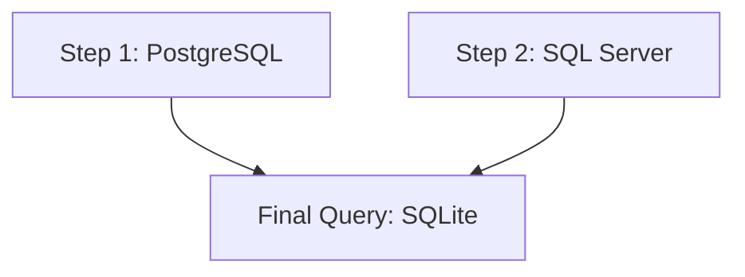

# Beacon UI Components

## Overview

Beacon UI is built with Blazor Server and MudBlazor 8.0. It follows a component-based architecture with reusable custom components.

---

## Technology Stack

| Technology | Purpose |
|------------|---------|
| Blazor Server | SPA framework |
| MudBlazor 8.0 | UI component library |
| Highlight.js | SQL syntax highlighting |
| Mermaid.js | Query flow diagrams |
| Blazored.LocalStorage | Theme persistence |

---

## Layout Structure

**File:** `Beacon.UI/Components/Layout/MainLayout.razor`

```
┌─────────────────────────────────────────────────────────────┐
│  MudAppBar (Dense)                                          │
│  [HomeButton] ─────────────────────── [Theme] [Settings]    │
├──────────────┬──────────────────────────────────────────────┤
│  MudDrawer   │  MudMainContent                              │
│  (250px)     │                                              │
│              │  @Body                                       │
│  Navigation  │                                              │
│  - Home      │                                              │
│  - DataSrc   │                                              │
│  - Alerts    │                                              │
│    - Recip   │                                              │
│    - Queries │                                              │
│    - Subs    │                                              │
│    - Notifs  │                                              │
│    - Tasks   │                                              │
│  - Migration │                                              │
│  - About     │                                              │
└──────────────┴──────────────────────────────────────────────┘
```

### Theme Support
- Dark/Light mode toggle
- Persisted to localStorage
- Highlight.js theme changes dynamically

```csharp
private async Task ChangeTheme()
{
    _isDark = !_isDark;
    await LocalStorage.SetItemAsync("IsDark", _isDark.ToString());
    await LoadTheme(); // Switch highlight.js CSS
}
```

---

## Pages Structure

```
Components/Pages/
├── Home.razor                    # Dashboard with statistics
├── About.razor                   # System information
├── Error.razor                   # Error page
│
├── DataSources/
│   ├── DataSources.razor         # List data sources
│   ├── AddDataSourceDialog.razor # Add/edit dialog
│   └── QueryEditor.razor         # Ad-hoc query execution
│
├── Recipients/
│   ├── Recipients.razor          # List recipients
│   ├── AddRecipientDialog.razor  # Add dialog
│   └── UpdateRecipientDialog.razor # Edit dialog
│
├── Queries/
│   ├── Queries.razor             # List queries
│   ├── AddQuery.razor            # Create query with steps
│   ├── QueryDetails.razor        # View/edit query
│   └── ExecuteStepParametersDialog.razor # Parameter input
│
├── Subscriptions/
│   ├── Subscriptions.razor       # List subscriptions
│   ├── SubscriptionDetails.razor # View subscription
│   ├── AddSubscriptionDialog.razor # Create subscription
│   └── AddRecipientsDialog.razor # Add recipients to subscription
│
├── Notifications/
│   ├── Notifications.razor       # List notifications
│   └── NotificationDetails.razor # View notification details
│
├── QueryExecutionHistory/
│   └── QueryExecutionHistoryDetails.razor # Execution details
│
├── Tasks/
│   ├── Tasks.razor               # List tasks
│   ├── TaskDetails.razor         # View task with history
│   ├── ResolveTaskDialog.razor   # Resolve task dialog
│   └── AddCommentDialog.razor    # Add comment dialog
│
└── DataMigration/
    ├── MigrationJobs.razor       # List migration jobs
    ├── CreateMigrationJob.razor  # Create migration job
    └── MigrationHistory.razor    # Execution history
```

---

## Custom Components

### SqlEditor

**File:** `Beacon.UI/Components/Custom/SqlEditor.razor`

Full-featured SQL editor with:
- Syntax highlighting (Highlight.js)
- Auto-complete from database metadata
- Parameter extraction
- Execution preview

```razor
<SqlEditor @bind-Value="@_sqlValue"
           DataSourceId="@_selectedDataSourceId"
           OnParametersChanged="@HandleParametersChanged" />
```

**Key Features:**
- `@bind-Value` - Two-way SQL binding
- `DataSourceId` - Load metadata for autocomplete
- `OnParametersChanged` - Callback when parameters detected
- JavaScript interop for highlighting

---

### QueryStepBuilder

**File:** `Beacon.UI/Components/Custom/QueryStepBuilder.razor`

Multi-step query builder:
- Add/remove/reorder steps
- Each step targets different data source
- Step parameters management
- Preview execution per step

```razor
<QueryStepBuilder Steps="@_query.Steps"
                  OnStepAdded="@HandleStepAdded"
                  OnStepRemoved="@HandleStepRemoved"
                  OnPreviewStep="@PreviewStep" />
```

---

### FinalQueryEditor

**File:** `Beacon.UI/Components/Custom/FinalQueryEditor.razor`

Editor for final query with @result references:
- Shows available virtual tables (@result1, @result2, etc.)
- SQLite syntax for cross-database joins
- Preview with all step results combined

```razor
<FinalQueryEditor @bind-Value="@_query.FinalQuery"
                  StepCount="@_query.Steps.Count"
                  OnPreview="@PreviewFinalQuery" />
```

---

### QueryFlowDiagram

**File:** `Beacon.UI/Components/Custom/QueryFlowDiagram.razor`

Mermaid.js visualization of query execution flow:
- Shows each step with data source
- Displays cross-database relationships
- Final query aggregation

```razor
<QueryFlowDiagram Steps="@_query.Steps"
                  FinalQuery="@_query.FinalQuery" />
```

**Generated Mermaid:**


---

### DatabaseExplorer

**File:** `Beacon.UI/Components/Custom/DatabaseExplorer.razor`

Tree view of database schema:
- Schemas > Tables > Columns
- Column details (type, nullable, PK, FK)
- Click to insert into SQL editor
- Refresh metadata

```razor
<DatabaseExplorer DataSourceId="@_selectedDataSourceId"
                  OnColumnSelected="@InsertColumnName" />
```

---

### QueryResultsPreview

**File:** `Beacon.UI/Components/Custom/QueryResultsPreview.razor`

Data grid for query results:
- Paginated display
- Column sorting
- Export to CSV/Excel
- Shows first 10 rows inline

```razor
<QueryResultsPreview Results="@_previewResults"
                     TotalCount="@_totalCount"
                     ExecutionTimeMs="@_executionTime" />
```

---

### QueryExecutionResultsPreview

**File:** `Beacon.UI/Components/Custom/QueryExecutionResultsPreview.razor`

Extended preview for execution history:
- Full result JSON parsing
- Expandable rows
- Download full results

---

### CronExpressionField

**File:** `Beacon.UI/Components/Custom/CronExpressionField.razor`

Cron expression input with:
- Validation via Cronos
- Human-readable description
- Next execution preview
- Preset suggestions

```razor
<CronExpressionField @bind-Value="@_cronExpression"
                     Label="Schedule"
                     Required="true" />
```

**Presets:**
- Every 5 minutes
- Hourly
- Daily at midnight
- Weekly on Monday
- Monthly on 1st

---

### ExecutionStatusChip

**File:** `Beacon.UI/Components/Custom/ExecutionStatusChip.razor`

Colored status indicator:

```razor
<ExecutionStatusChip Status="@NotificationStatus.NotificationSent" />
```

| Status | Color |
|--------|-------|
| Created | Default |
| NotificationSent | Success (green) |
| NotificationSilenced | Warning (yellow) |
| NoResults | Info (blue) |
| Timeout | Error (red) |

---

### CodeHighlight

**File:** `Beacon.UI/Components/Custom/CodeHighlight.razor`

SQL syntax highlighting using Highlight.js:

```razor
<CodeHighlight Code="@_sqlQuery" Language="sql" />
```

**JavaScript Interop:**
```javascript
function highlightCode(element) {
    hljs.highlightElement(element);
}
```

---

### ParameterInputDialog

**File:** `Beacon.UI/Components/Custom/ParameterInputDialog.razor`

Dynamic parameter input form:
- Text/Number/DateTime inputs based on ParameterType
- Validation
- Default values from placeholder

```razor
<ParameterInputDialog Parameters="@_queryParameters"
                      OnSubmit="@ExecuteWithParameters" />
```

---

### ErrorDetailsDialog

**File:** `Beacon.UI/Components/Custom/ErrorDetailsDialog.razor`

Error display dialog:
- Stack trace
- Inner exception details
- Copy to clipboard

---

## Common Patterns

### Dialog Usage

```csharp
// Opening a dialog
var parameters = new DialogParameters<AddRecipientDialog>
{
    { x => x.Recipient, new RecipientData() }
};

var dialog = await DialogService.ShowAsync<AddRecipientDialog>("Add Recipient", parameters);
var result = await dialog.Result;

if (!result.Canceled)
{
    await LoadData(); // Refresh
}
```

### Form Validation

```razor
<MudForm @ref="@_form" @bind-IsValid="_isFormValid" @bind-Errors="errors">
    <MudTextField @bind-Value="@Model.Name"
                  Required="true"
                  RequiredError="Name is required"
                  OnlyValidateIfDirty="true" />
</MudForm>

@code {
    async Task Submit()
    {
        await _form.Validate();
        if (!_form.IsValid) return;
        // Submit logic
    }
}
```

### Data Loading Pattern

```csharp
private bool _loading = true;
private List<SomeData> _data = new();

protected override async Task OnInitializedAsync()
{
    await LoadData();
}

private async Task LoadData()
{
    _loading = true;
    try
    {
        _data = await Service.GetData(CancellationToken.None);
    }
    finally
    {
        _loading = false;
    }
}
```

### Table with Pagination

```razor
<MudTable Items="@_items"
          ServerData="@LoadServerData"
          Loading="@_loading"
          Dense="true"
          Hover="true">
    <HeaderContent>
        <MudTh><MudTableSortLabel SortBy="new Func<T, object>(x => x.Name)">Name</MudTableSortLabel></MudTh>
    </HeaderContent>
    <RowTemplate>
        <MudTd DataLabel="Name">@context.Name</MudTd>
    </RowTemplate>
    <PagerContent>
        <MudTablePager />
    </PagerContent>
</MudTable>
```

---

## Page Examples

### Recipients List Pattern

```razor
@page "/recipients"

<MudContainer MaxWidth="MaxWidth.ExtraLarge" Class="mt-4">
    <MudPaper Elevation="1" Class="pa-4">
        <MudStack Row="true" Justify="Justify.SpaceBetween" AlignItems="AlignItems.Center" Class="mb-4">
            <MudText Typo="Typo.h5">Recipients</MudText>
            <MudButton Variant="Variant.Filled" Color="Color.Primary" OnClick="@OpenAddDialog">
                <MudIcon Icon="@Icons.Material.Filled.Add" Class="mr-1" /> Add Recipient
            </MudButton>
        </MudStack>

        <MudTextField @bind-Value="@_searchQuery"
                      Placeholder="Search..."
                      Adornment="Adornment.Start"
                      AdornmentIcon="@Icons.Material.Filled.Search"
                      DebounceInterval="300"
                      OnDebounceIntervalElapsed="@LoadData" />

        <MudTable Items="@_recipients" Loading="@_loading" Hover="true">
            ...
        </MudTable>
    </MudPaper>
</MudContainer>
```

### Details Page Pattern

```razor
@page "/queries/{QueryId:int}"

<MudContainer MaxWidth="MaxWidth.ExtraLarge" Class="mt-4">
    @if (_loading)
    {
        <MudProgressCircular Indeterminate="true" />
    }
    else if (_query == null)
    {
        <MudAlert Severity="Severity.Error">Query not found</MudAlert>
    }
    else
    {
        <MudTabs Elevation="1" Rounded="true" ApplyEffectsToContainer="true">
            <MudTabPanel Text="Overview">
                <!-- Overview content -->
            </MudTabPanel>
            <MudTabPanel Text="Subscriptions">
                <!-- Subscriptions list -->
            </MudTabPanel>
            <MudTabPanel Text="History">
                <!-- Execution history -->
            </MudTabPanel>
        </MudTabs>
    }
</MudContainer>
```

---

## Snackbar Notifications

```csharp
@inject ISnackbar Snackbar

// Success
Snackbar.Add("Saved successfully", Severity.Success);

// Error
Snackbar.Add(response.Message, Severity.Error);

// Info with action
Snackbar.Add("Task created", Severity.Info, config =>
{
    config.Action = "View";
    config.ActionColor = Color.Primary;
    config.Onclick = snackbar => NavigationManager.NavigateTo($"/tasks/{taskId}");
});
```

---

## Route Structure

| Route | Page | Parameters |
|-------|------|------------|
| `/` or `/dashboard` | Home.razor | - |
| `/data-sources` | DataSources.razor | - |
| `/recipients` | Recipients.razor | - |
| `/queries` | Queries.razor | - |
| `/queries/{QueryId}` | QueryDetails.razor | QueryId: int |
| `/queries/add` | AddQuery.razor | - |
| `/subscriptions` | Subscriptions.razor | - |
| `/subscriptions/{SubscriptionId}` | SubscriptionDetails.razor | SubscriptionId: int |
| `/notifications` | Notifications.razor | - |
| `/notifications/{NotificationId}` | NotificationDetails.razor | NotificationId: int |
| `/tasks` | Tasks.razor | - |
| `/tasks/{TaskId}` | TaskDetails.razor | TaskId: int |
| `/data-migration` | MigrationJobs.razor | - |
| `/about` | About.razor | - |

---

## JavaScript Interop Files

**Location:** `Beacon.UI/wwwroot/`

| File | Purpose |
|------|---------|
| `highlight.min.js` | SQL syntax highlighting |
| `sqlEditorHelpers.js` | SQL editor autocomplete |
| `css/beacon-styles.css` | Custom styles |

### JS Interop Example

```csharp
@inject IJSRuntime JS

// Call JavaScript function
await JS.InvokeVoidAsync("highlightCode", elementRef);

// Get return value
var result = await JS.InvokeAsync<string>("getEditorValue", editorId);
```

---

## UI Helper Classes

**File:** `Beacon.UI/Components/UiHelpers.cs`

```csharp
public static class UiHelpers
{
    public const string MaskedDestinationValue = "••••••••";

    public static string FormatDuration(double milliseconds) => ...;
    public static string GetNotificationTypeIcon(NotificationType type) => ...;
    public static Color GetStatusColor(NotificationStatus status) => ...;
}
```

**Masked Destinations:** Sensitive data like webhook URLs are masked in edit dialogs. The original value is preserved if not modified.
