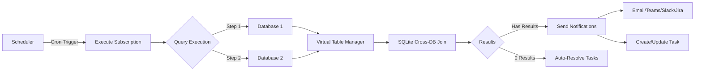

# Beacon Architecture Quick Reference

## 30-Second Overview

Beacon = Database monitoring + Scheduled queries + Multi-channel notifications + ETL orchestration

**Think of it as**: "Zapier for databases with smart alerting"

---

## Core Entities

```
DataSource (Database Connection)
    ↓
Query (SQL Definition)
    ↓
QueryStep (Individual SQL steps, multi-database support)
    ↓
Subscription (Cron schedule + Recipients)
    ↓
Notification (Delivery record)
    ↓
QueryTask (Issue tracking, auto-resolves)
```

---

## Execution Flow



---

## Key Services

### QueryService
- CRUD operations for queries
- Execute queries (single/multi-step)
- Parameter substitution
- Preview execution
- Result storage

### SubscriptionService
- Schedule management (cron)
- Execution orchestration
- Parameter override
- Recipient management

### NotificationService
- Dispatch to adapters
- History tracking
- Delivery status

### TaskService
- Auto-create from subscriptions
- Auto-resolve when query returns 0 results
- Comment management
- Lifecycle tracking

### MigrationService
- ETL job execution
- Insert/Upsert/Truncate/Sync modes
- Bulk operations
- Error tracking

---

## Notification Adapters

| Adapter | Implementation | Max Display | Attachment Support |
|---------|----------------|-------------|-------------------|
| **Email** | `IEmailAdapter` (user-implemented) | 20 rows | ✅ CSV with ALL rows |
| **Slack** | `SlackAdapter` (built-in) | 100 rows, 20 cols | ❌ |
| **Teams** | `TeamsAdapter` (built-in) | 10 rows, 3 cols | ❌ |
| **Jira** | `JiraAdapter` (built-in) | 50 rows | ✅ CSV in description |

**Pattern**: All implement `IAdapter` interface, routed via `AdapterFactory`

---

## Multi-Step Queries

### Virtual Table References
```sql
-- Step 1: Query PostgreSQL
SELECT customer_id, SUM(amount) as total
FROM orders
WHERE date = CURRENT_DATE

-- Step 2: Reference Step 1 results
SELECT COUNT(*) as customer_count, AVG(total) as avg_order
FROM @@result1  -- Virtual table from Step 1
```

### Cross-Database Joins
```sql
-- Step 1: PostgreSQL
SELECT user_id, email FROM users

-- Step 2: SQL Server
SELECT user_id, SUM(amount) as total FROM orders

-- Step 3: Join via SQLite
SELECT u.email, o.total
FROM @@result1 u
JOIN @@result2 o ON u.user_id = o.user_id
```

**Implementation**: `VirtualTableManager` creates SQLite in-memory tables for cross-DB queries

---

## Data Model Highlights

### BaseArchivableEntity
All main entities inherit soft-delete capability:
```csharp
public class BaseArchivableEntity
{
    public DateTime CreatedTime { get; set; }
    public DateTime? ArchivedTime { get; set; }  // Soft delete
}
```
EF Core global query filter: `WHERE ArchivedTime IS NULL`

### IChangeableEntity
For audit tracking:
```csharp
public interface IChangeableEntity
{
    string? CreatedBy { get; set; }
    string? ModifiedBy { get; set; }
    DateTime? ModifiedTime { get; set; }
}
```

### NotificationType Enum
```csharp
public enum NotificationType
{
    Email = 0,
    Teams = 1,
    Jira = 2,
    Slack = 4
}
```

---

## Common Patterns

### 1. Factory Pattern (Adapters)
```csharp
public class AdapterFactory
{
    public IAdapter GetAdapter(NotificationType type)
    {
        return type switch {
            NotificationType.Email => _serviceProvider.GetRequiredService<IEmailAdapter>(),
            NotificationType.Slack => _serviceProvider.GetRequiredService<SlackAdapter>(),
            NotificationType.Teams => _serviceProvider.GetRequiredService<TeamsAdapter>(),
            NotificationType.Jira => _serviceProvider.GetRequiredService<JiraAdapter>(),
            _ => throw new ArgumentException($"Unknown notification type: {type}")
        };
    }
}
```

### 2. CQRS with MediatR
```csharp
// Request
public record ExecuteQueryCommand(int QueryId) : IRequest<QueryResult>;

// Handler
internal sealed class ExecuteQueryCommandHandler : IRequestHandler<ExecuteQueryCommand, QueryResult>
{
    public async Task<QueryResult> Handle(ExecuteQueryCommand request, CancellationToken ct)
    {
        // Business logic
    }
}
```

### 3. Conditional Querying
```csharp
query
    .WhereIf(searchTerm != null, x => x.Name.Contains(searchTerm))
    .WhereIf(status.HasValue, x => x.Status == status)
```

### 4. Masked Sensitive Data
```csharp
// In DTOs/responses
public string MaskedDestination => string.IsNullOrEmpty(Destination)
    ? string.Empty
    : "••••••••";

// UI sends back masked value → Service preserves original if unchanged
```

---

## Configuration

### Program.cs Setup
```csharp
// 1. Add database provider
builder.Services.AddPostgreSqlBeacon(
    builder.Configuration.GetConnectionString("BeaconContext")!,
    schema: "beacon");

// 2. Add Beacon admin services
builder.Services.AddBeaconAdmin(builder.Configuration, options =>
{
    options.AddBeaconScheduler<HangfireScheduler>();
    options.AddEmailAdapter<SmtpEmailAdapter>();
    options.BaseUrl = "https://example.com/beacon";  // For notification links
});

// 3. Configure UI
app.UseBeaconUI()
    .UseBasicAuthentication("admin", "password")
    .AddBlazorUI("/beacon");

// 4. Run migrations
ServiceConfiguration.UseBeacon(app.Services);
```

### appsettings.json
```json
{
  "ConnectionStrings": {
    "BeaconContext": "Host=localhost;Database=beacon;..."
  },
  "Beacon": {
    "BaseUrl": "https://example.com/beacon"
  }
}
```

---

## Technology Stack

### Backend
- **.NET 9.0** / C# 13
- **EF Core 9.0** (metadata DB)
- **Dapper** (query execution)
- **MediatR** (CQRS)
- **EFCore.BulkExtensions** (ETL performance)

### UI
- **Blazor Server**
- **MudBlazor 8.0** (component library)
- **Highlight.js** (SQL syntax highlighting)
- **Mermaid.js** (diagrams)

### Database Drivers
- **Npgsql** (PostgreSQL)
- **System.Data.SqlClient** (SQL Server)
- **MySql.Data** (MySQL)
- **SQLite** (virtual tables for cross-DB joins)

### Scheduling
- **IBeaconScheduler** interface
- User implements with Hangfire, Quartz.NET, or custom

### Integrations
- **Atlassian.SDK** (Jira)
- **AdaptiveCards** (Teams)
- **ClosedXML** (Excel export)
- **CsvHelper** (CSV export)

---

## File Structure

```
src/Beacon.Core/
├── Data/
│   ├── Entities/                # EF Core entities
│   ├── Enums/                   # Enums (NotificationType, MigrationMode, etc.)
│   └── BeaconContext.cs      # DbContext
├── Services/
│   ├── Query/                   # QueryService, VirtualTableManager
│   ├── Subscription/            # SubscriptionService
│   ├── Notification/            # NotificationService
│   ├── Task/                    # TaskService
│   ├── DataSource/              # DataSourceService
│   └── Migration/               # MigrationService
├── Adapters/
│   ├── Slack/SlackAdapter.cs    # Slack Block Kit implementation
│   ├── Teams/TeamsAdapter.cs    # Teams Adaptive Cards
│   ├── Mail/IEmailAdapter.cs    # Email interface (user implements)
│   └── Jira/JiraAdapter.cs      # Jira issue creation
└── ServiceConfiguration.cs       # DI registration

src/Beacon.Core.PostgreSql/
└── Migrations/                   # EF Core migrations for PostgreSQL

src/Beacon.Core.SqlServer/
└── Migrations/                   # EF Core migrations for SQL Server

src/Beacon.UI/
├── Components/
│   ├── Layout/                  # MainLayout, NavMenu
│   ├── Pages/                   # Feature pages (Queries, Subscriptions, etc.)
│   └── Custom/                  # Reusable components (SqlEditor, ResultsTable)
└── wwwroot/                     # Static assets

Beacon.UI.AspNet/
└── BeaconUIExtensions.cs     # UseBeaconUI() middleware

src/Beacon.SampleProject/
└── Program.cs                   # Example implementation
```

---

## Key Features by Use Case

### 1. Data Quality Monitoring
```sql
-- Detect orphaned records
SELECT o.id, 'Orphaned order' as issue
FROM orders o
LEFT JOIN users u ON o.user_id = u.id
WHERE u.id IS NULL
```
**Subscription**: Every hour, notify on Teams if results found

### 2. Database Health
```sql
-- Monitor table sizes
SELECT tablename, pg_size_pretty(pg_total_relation_size(tablename))
FROM pg_tables
WHERE schemaname = 'public'
ORDER BY pg_total_relation_size(tablename) DESC
```
**Subscription**: Daily at 9 AM, email CSV to DBA team

### 3. Business Rule Enforcement
```sql
-- Orders with discount > total (invalid)
SELECT id, total, discount
FROM orders
WHERE discount > total
```
**Subscription**: Every 15 min, create Jira issue if found

### 4. Automated Reporting
```sql
-- Daily sales report
SELECT product, SUM(quantity), SUM(revenue)
FROM orders
WHERE DATE(created_at) = CURRENT_DATE - 1
GROUP BY product
```
**Subscription**: Daily at 8 AM, email full CSV to management

### 5. Cross-Database ETL
```
Source: Production PostgreSQL (orders)
Target: Analytics SQL Server (orders_fact)
Mode: Sync (perfect mirror)
Schedule: Hourly
```

---

## Task Management (Alerting)

### Auto-Creation
Enable `CreateTasks` on subscription:
```csharp
subscription.CreateTasks = true;
```

When query returns results:
1. **First time**: Create new task
2. **Subsequent**: Update existing task, add comment with new count
3. **Resolved**: When query returns 0 results, auto-resolve task

### Lifecycle
```
Query returns 5 results → Task created (Status: Open, Count: 5)
    ↓
Query returns 8 results → Task updated (Count: 5 → 8, Comment added)
    ↓
Query returns 0 results → Task auto-resolved (Status: Resolved)
    ↓
Query returns 3 results → New task created (issue reoccurred)
```

### Collaboration
- Add comments to tasks
- Assign to users
- Track history
- View related tasks (same query)

---

## Migration Modes (ETL)

| Mode | Behavior | Use Case |
|------|----------|----------|
| **Insert** | Insert new records only, ignore existing | Append-only logs |
| **Upsert** | Insert new + update existing (by key) | CDC, sync with updates |
| **Truncate** | Delete all + insert fresh data | Full refresh, no updates needed |
| **Sync** | Perfect mirror (delete removed records) | Master data sync |

**Key matching**: Uses natural keys (e.g., email, external_id) or surrogate keys

---

## Development Guidelines

### Entity Design
```csharp
public class MyEntity : BaseArchivableEntity, IChangeableEntity
{
    public int Id { get; set; }
    public string Name { get; set; } = null!;  // Required, non-nullable
    public string? Description { get; set; }   // Optional, nullable

    // IChangeableEntity
    public string? CreatedBy { get; set; }
    public string? ModifiedBy { get; set; }
    public DateTime? ModifiedTime { get; set; }
}
```

### Handler Structure
```csharp
public record MyCommand(int Id) : IRequest<MyResponse>;

internal sealed class MyCommandHandler : IRequestHandler<MyCommand, MyResponse>
{
    private readonly BeaconContext _context;

    public MyCommandHandler(BeaconContext context)
    {
        _context = context;
    }

    public async Task<MyResponse> Handle(MyCommand request, CancellationToken ct)
    {
        // Implementation
    }
}

// Request/response at file end (no comment!)
```

### Common Mistakes to Avoid
❌ **Don't**: `.Include()` when followed by `.Select(new ...)`
✅ **Do**: EF Core generates JOINs automatically in projections

❌ **Don't**: Create migrations directly
✅ **Do**: User creates migrations manually, Claude only mentions need

❌ **Don't**: Use generic names like `item`, `data`
✅ **Do**: Use descriptive names like `query`, `subscription`

---

## Troubleshooting

### Query Timeout
- Increase `Subscription.Timeout`
- Add indexes to queried tables
- Reduce result set with `LIMIT`

### Notification Not Sent
- Check `Subscription.SendNotifications` is enabled
- Verify recipient configuration (webhook URL, email)
- Check notification history for errors

### Task Not Auto-Resolving
- Verify query returns 0 results (not empty result set)
- Check `Subscription.CreateTasks` is enabled
- Ensure task status is "Open" (not manually closed)

### Migration Errors
- Ensure no schema name in migration SQL
- Schema specified at runtime via `AddPostgreSqlBeacon(..., schema: "name")`
- For provider-specific migrations, use appropriate project

---

## Quick Commands

### Build
```bash
dotnet build --property WarningLevel=0
```

### Run
```bash
dotnet run --project Beacon.SampleProject
```

### Watch
```bash
dotnet watch run --project Beacon.SampleProject
```

### Migrations
```bash
# Schema-agnostic (uses default "beacon")
dotnet ef migrations add MigrationName \
    --project Beacon.Core \
    --startup-project Beacon.SampleProject

# Provider-specific
dotnet ef migrations add MigrationName \
    --project Beacon.Core.PostgreSql \
    --startup-project Beacon.SampleProject
```

---

## URLs & Resources

- **GitHub**: https://github.com/moberghr/beacon
- **Docs**: https://moberghr.github.io/beacon
- **Sample Project**: src/Beacon.SampleProject/Program.cs
- **Architecture Docs**: docs/advanced/architecture.md
