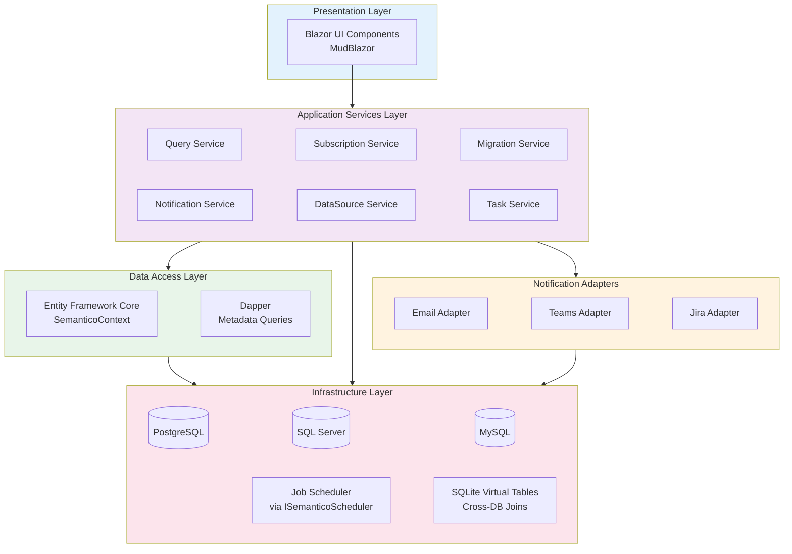
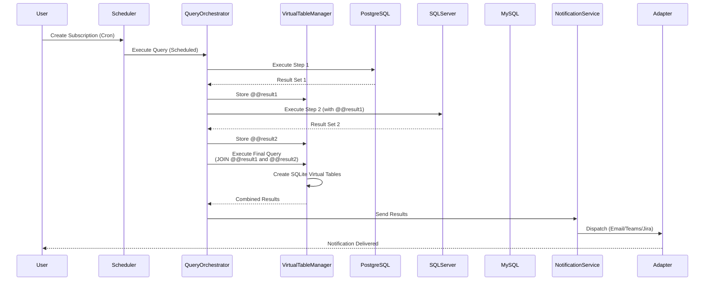
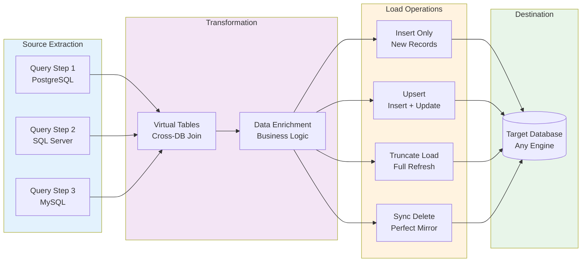

# Semantico

[](https://www.nuget.org/)
[](https://moberghr.github.io/semantico)
[](LICENSE)
[](https://dotnet.microsoft.com/)

## Semantic Database Monitoring & Orchestration

**Transform your database monitoring through intelligent queries, flexible alerting, and cross-database orchestration**

**Semantico** is a powerful .NET library that enables semantic alerts and notifications for databases with robust data orchestration capabilities. Monitor data quality, enforce business rules, automate reporting, and orchestrate complex ETL workflows across PostgreSQL, SQL Server, and MySQL databases.

## 🎯 Core Capabilities

### 🔍 Query Monitoring
Create semantic SQL queries to monitor data quality, business rules, and database health with multi-step execution

### 🔔 Smart Alerting
Deliver notifications via Email, Microsoft Teams, or Jira with rich formatting and complete result attachments

### 🔄 Data Migration
Orchestrate ETL workflows with Insert, Upsert, Truncate, and Sync modes across different database engines

### 🔗 Cross-Database Joins
Query across PostgreSQL, SQL Server, and MySQL simultaneously with virtual table abstractions

### 📋 Task Management
Automatic alerting tasks from subscriptions with lifecycle tracking, auto-resolution when issues are fixed, and team collaboration

## 🚀 Quick Start

Add Semantico to your ASP.NET application in under 30 minutes:

1. **Install NuGet packages**
   ```bash
   dotnet add package Semantico.Core.PostgreSql
   dotnet add package Semantico.UI.AspNet
   ```

2. **Configure in Program.cs**
   ```csharp
   builder.Services.AddPostgreSqlSemantico(
       builder.Configuration.GetConnectionString("SemanticoContext")!,
       schema: "semantico");

   builder.Services.AddSemanticoAdmin(builder.Configuration, options =>
   {
       options.AddSemanticoScheduler<YourScheduler>();
       options.BaseUrl = "https://your-domain.com/semantico"; // For notification links
   });
   ```

3. **Add UI and run migrations**
   ```csharp
   app.UseSemanticoUI()
       .UseBasicAuthentication("admin", "admin")
       .AddBlazorUI("/semantico");

   ServiceConfiguration.UseSemantico(app.Services);
   ```

4. **Access the UI** at `http://localhost:5000/semantico`

📚 [View detailed quick start guide →](https://moberghr.github.io/semantico/getting-started/quick-start)

## 🏗️ System Architecture

Semantico follows Clean Architecture principles with clear separation of concerns:



### Query Execution Flow

Multi-step queries with cross-database capabilities:



### Data Migration Flow

ETL orchestration with multiple migration modes:



## ✨ Key Features

### 🔍 Semantic Query Monitoring
- Multi-step query execution with result chaining
- Dynamic parameter substitution (@@user_id, @@date)
- Query preview with first 10 rows
- Execution history with full audit trail

### ⏱️ Scheduling & Automation
- Cron expression support (every 5 min to monthly)
- Pluggable scheduler via `ISemanticoScheduler` interface
- Configurable timeouts and retry policies
- Next execution time calculation

### 🔔 Multi-Channel Notifications
- **Email** with HTML table + CSV/Excel attachment
- **Microsoft Teams** with Adaptive Cards
- **Jira** issue creation and updates
- Full result attachments (unlimited rows)

### 💾 Multi-Database Support
- PostgreSQL, SQL Server, MySQL connectivity
- Cross-database joins via SQLite virtual tables
- Database metadata introspection with caching
- Encrypted connection strings (AES)

### 🔄 Data Migration (ETL)
- 4 migration modes: Insert, Upsert, Truncate, Sync
- Bulk operations with row-level error tracking
- Atomic transactions with rollback on failure
- Execution metrics (rows/second, success rate)

### 💻 Developer Experience
- SQL editor with syntax highlighting
- Database explorer with schema introspection
- Parameter validation and autocomplete
- Query flow visualization

### 📋 Task Management
- Automatic task creation from subscriptions with `CreateTasks` enabled
- Auto-resolution when query returns 0 results (issue fixed)
- Result count trend visualization and history charts
- Task comments for team collaboration
- Related tasks discovery from same query
- Manual resolution with notes and user tracking

[Explore all features →](https://moberghr.github.io/semantico/features/)

## 📦 Installation

### NuGet Packages

Semantico is distributed as NuGet packages. Install the database provider package for your needs:

**For PostgreSQL (recommended):**
```bash
dotnet add package Semantico.Core.PostgreSql
dotnet add package Semantico.UI.AspNet
```

**For SQL Server:**
```bash
dotnet add package Semantico.Core.SqlServer
dotnet add package Semantico.UI.AspNet
```

### Basic Setup

Add to your ASP.NET Core `Program.cs`:

```csharp
using Semantico.Core.PostgreSql;
using Semantico.UI.AspNet;

var builder = WebApplication.CreateBuilder(args);

// Configure Semantico with PostgreSQL
builder.Services.AddPostgreSqlSemantico(
    builder.Configuration.GetConnectionString("SemanticoContext")!,
    schema: "semantico");

// Add Semantico admin UI
builder.Services.AddSemanticoAdmin(builder.Configuration, options =>
{
    options.AddSemanticoScheduler<YourScheduler>();
    options.BaseUrl = "https://your-domain.com/semantico"; // For notification links
});

var app = builder.Build();

// Configure Semantico UI
app.UseSemanticoUI()
    .UseBasicAuthentication("admin", "admin")
    .UseAuthorization()
    .AddBlazorUI("/semantico");

// Run migrations
ServiceConfiguration.UseSemantico(app.Services);

app.Run();
```

Add connection string to `appsettings.json`:

```json
{
  "ConnectionStrings": {
    "SemanticoContext": "Host=localhost;Database=semantico;Username=postgres;Password=yourpassword"
  }
}
```

📚 [View detailed installation guide →](https://moberghr.github.io/semantico/getting-started/installation)

## 📖 Documentation

- **Getting Started**
  - [Installation Guide](https://moberghr.github.io/semantico/getting-started/installation) - NuGet package setup
  - [Quick Start](https://moberghr.github.io/semantico/getting-started/quick-start) - First query in 30 minutes
  - [Configuration](https://moberghr.github.io/semantico/getting-started/configuration) - Connection strings and options

- **Features**
  - [Projects](https://moberghr.github.io/semantico/features/projects) - Database connection management
  - [Queries](https://moberghr.github.io/semantico/features/queries) - Query creation and parameters
  - [Multi-Step Queries](https://moberghr.github.io/semantico/features/multi-step-queries) - Advanced query chaining
  - [Subscriptions](https://moberghr.github.io/semantico/features/subscriptions) - Scheduled execution
  - [Notifications](https://moberghr.github.io/semantico/features/notifications) - Email, Teams, Jira delivery
  - [Tasks](https://moberghr.github.io/semantico/features/tasks) - Alerting task management

- **Advanced**
  - [Query Chaining](https://moberghr.github.io/semantico/advanced/query-chaining) - Cross-project queries
  - [Multi-Tenant Deployments](https://moberghr.github.io/semantico/advanced/multi-tenant) - Schema-agnostic configuration
  - [Architecture](https://moberghr.github.io/semantico/advanced/architecture) - Clean Architecture deep-dive

- **Reference**
  - [API Services](https://moberghr.github.io/semantico/api/services) - Service interfaces
  - [Troubleshooting](https://moberghr.github.io/semantico/troubleshooting/common-issues) - Common issues and solutions

## 🎯 Common Use Cases

### 📊 Data Quality Monitoring
Alert on orphaned records, invalid states, NULL violations, and constraint failures. Keep your data clean with automated validation checks.

### 📈 Automated Reporting
Schedule daily sales reports, weekly performance summaries, and monthly analytics. Delivered as Excel/CSV attachments via email.

### 🏥 Database Health Monitoring
Monitor table growth, connection counts, disk usage, and replication lag. Proactive alerts keep your databases healthy.

### 🔗 Cross-Database Integration
ETL from production to data warehouse, sync master data across systems, multi-tenant distribution, consolidated metrics.

### ⚖️ Business Rule Enforcement
Monitor SLA violations, inventory thresholds, payment delays, and compliance rules. Automatic Jira ticket creation for violations.

### 🎫 Incident Management
Create Jira issues on first detection, add comments on follow-ups, automatically close when resolved. Full incident lifecycle tracking.

### 📋 Alert Lifecycle Management
Create alerting tasks from subscriptions, track result count trends over time, collaborate with comments, and auto-resolve when issues are fixed.

## 🛠️ Technology Stack

### Framework & Runtime
- .NET 9.0
- C# 13
- ASP.NET Core 9.0

### User Interface
- Blazor Server
- MudBlazor 8.0
- Highlight.js

### Data Access
- Entity Framework Core 9.0
- Dapper
- EFCore.BulkExtensions

### Database Drivers
- Npgsql (PostgreSQL)
- System.Data.SqlClient
- MySql.Data

### Job Scheduling
- ISemanticoScheduler interface (implement with Hangfire, Quartz.NET, or custom)
- Cronos (cron expression parsing)

### Integrations
- Atlassian.SDK (Jira)
- AdaptiveCards
- ClosedXML
- CsvHelper

## 🔧 Requirements

- **.NET 9.0** or later
- **PostgreSQL 12+** or **SQL Server 2019+** for Semantico metadata database
- **Job scheduler** implementing `ISemanticoScheduler` (e.g., Hangfire, Quartz.NET, or custom)
- **(Optional)** Email provider for email notifications (built-in support for any SMTP-compatible service)

## 🚦 Getting Started

### Step 1: Connect Data Sources
Add your PostgreSQL, SQL Server, or MySQL databases with encrypted connection strings

### Step 2: Create Semantic Queries
Write SQL queries to monitor data quality, business rules, or extract data for migration

### Step 3: Schedule & Automate
Create subscriptions with cron schedules and configure notification recipients

### Step 4: Track & Resolve
Enable task creation to track issues, add comments, and manage the resolution lifecycle

## 🤝 Support and Contributing

- **Issues** - [Report bugs or request features](https://github.com/moberghr/semantico/issues)
- **Discussions** - [Ask questions and share ideas](https://github.com/moberghr/semantico/discussions)
- **Contributing** - [Contribution guidelines](https://moberghr.github.io/semantico/contributing/guidelines)

---

## 📚 Resources

**Documentation**: [https://moberghr.github.io/semantico](https://moberghr.github.io/semantico)
**Repository**: [https://github.com/moberghr/semantico](https://github.com/moberghr/semantico)
**Version**: 1.0
**Copyright**: © 2025

Thank you for choosing Semantico! We hope you find it invaluable for managing your database monitoring, alerting, and orchestration needs.
