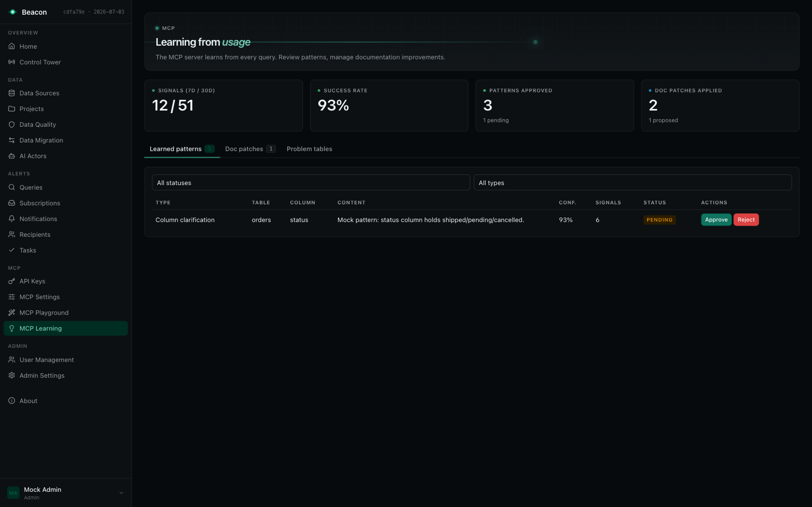
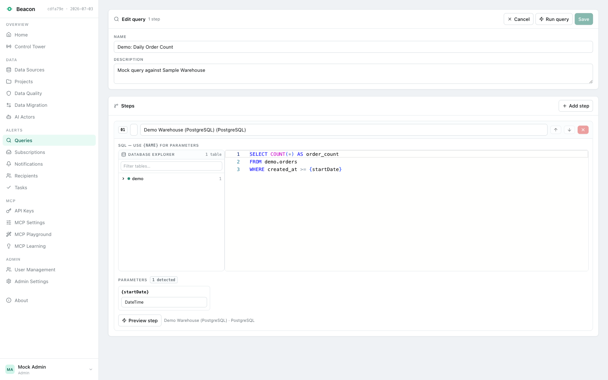
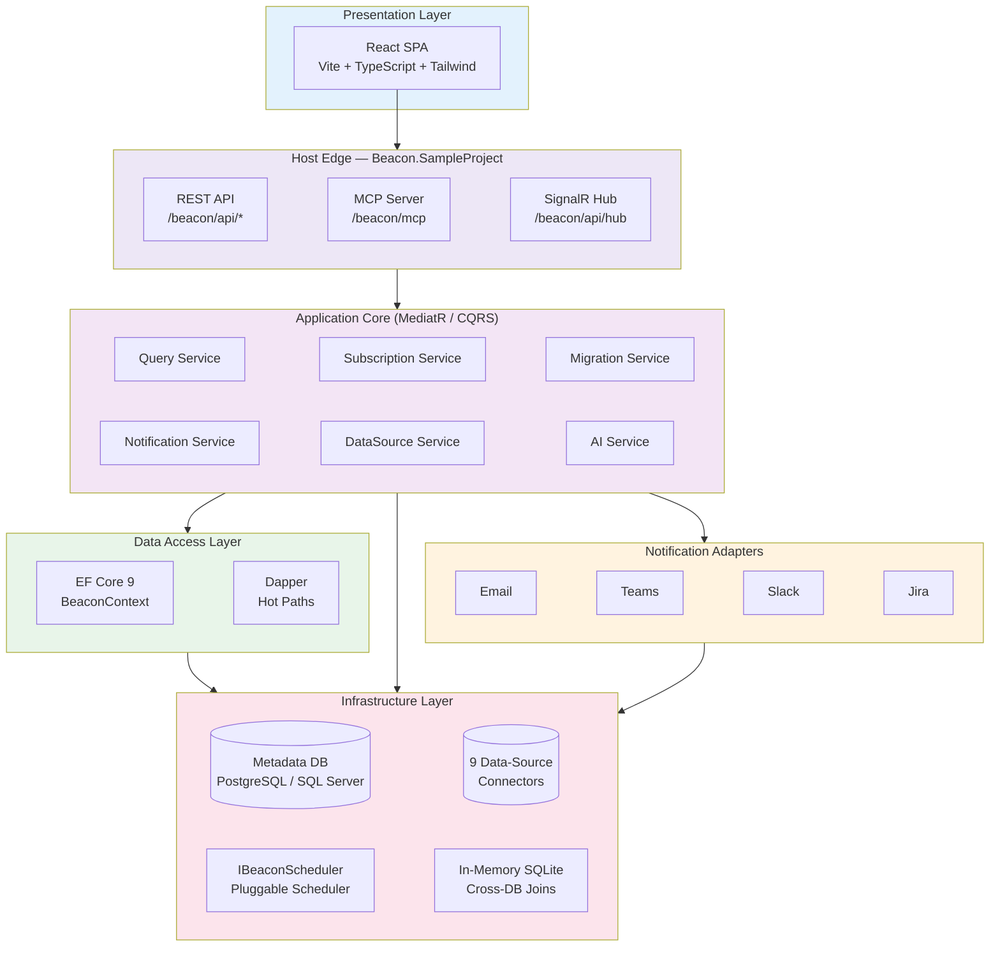
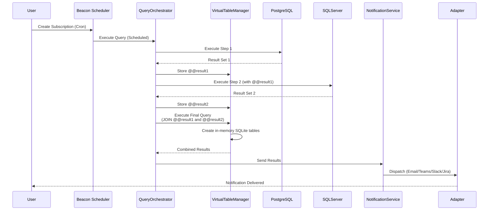

<div align="center">


# Beacon

**The database monitoring platform built for the AI era.**

Semantic alerts, cross-database orchestration, and a governed MCP server —
so your team *and* your AI assistants can watch, query, and move data safely.

[](https://www.nuget.org/)
[](https://mibu.github.io/semantico)
[](LICENSING.md)
[](https://dotnet.microsoft.com/)
[](https://react.dev/)

[Documentation](https://mibu.github.io/semantico) ·
[Quick Start](#-quick-start) ·
[MCP Server](#-the-mcp-server-give-your-ai-assistant-safe-hands) ·
[Embed via NuGet](#-embed-beacon-in-your-own-app) ·
[Licensing](LICENSING.md)

<br/>


<sub>Shown with sample data from Beacon's built-in mock mode (`npm run dev:mock`).</sub>

</div>

---

## What is Beacon?

Beacon is a **.NET 9 platform for semantic database monitoring, alerting, and data orchestration**. Point it at your databases — PostgreSQL, SQL Server, MySQL, BigQuery, Snowflake, Databricks, Azure Synapse, AWS CloudWatch, or any REST API — and it becomes the operations layer on top of them:

- **Watch** — scheduled SQL checks catch data-quality issues, broken business rules, and unhealthy databases before your users do.
- **Alert** — results delivered to Email, Microsoft Teams, Slack, Jira, or webhooks, with full datasets attached.
- **Move** — auditable ETL jobs (Insert / Upsert / Truncate / Sync) across different database engines.
- **Serve AI** — a built-in, production-hardened **MCP server** gives Claude, ChatGPT, and any MCP client read-only, PII-aware, fully audited access to your data.

It ships in two forms: a **self-hostable application** (clone and run) and **NuGet packages** you embed into your own ASP.NET Core application.

## Why teams pick Beacon

| | What you get |
|---|---|
| 🧠 **AI-grade SQL accuracy** | Natural-language questions become SQL grounded in an **M-Schema context with real sample values**, validated by a **multi-dialect AST parser**, and self-corrected through a **dry-run repair loop** — not a naive prompt-to-SQL pipe. |
| 🔁 **A self-improving MCP server** | Every MCP query records a usage signal — intent, generated SQL, routing, outcome, timing. A **learning loop** turns those signals into approved schema clarifications and documentation patches, so answers get better with use. |
| 🔐 **Security as a default, not an add-on** | AES-256-GCM–encrypted connection strings, SHA256-hashed scoped API keys shown exactly once, read-only enforcement at the connector level, PII detection and masking, login rate limiting, antiforgery, OIDC/SSO, JWT for MCP clients. |
| 🔗 **Cross-database queries** | Chain query steps across engines and join the results in in-memory SQLite (`@@result1`, `@@result2`) — no data warehouse required. |
| 📦 **Embeddable** | `AddBeaconServices()` drops the whole platform — UI, API, MCP server, scheduler — into your existing ASP.NET Core host. Your app, your auth, your domain. |
| 🔄 **Runtime-swappable LLM** | OpenAI, Anthropic Claude, Azure OpenAI, or AWS Bedrock — hot-swappable from admin settings without a restart, behind a concurrency-limited request queue with usage tracking. |

## See it

<table>
  <tr>
    <td width="50%">
      
      <p align="center"><b>Control Tower</b> — real-time health across every scheduled check, auto-refreshing.</p>
    </td>
    <td width="50%">
      
      <p align="center"><b>MCP Learning</b> — review learned schema patterns and documentation patches, approve or reject.</p>
    </td>
  </tr>
  <tr>
    <td width="50%">
      
      <p align="center"><b>Query editor</b> — Monaco SQL editing, database explorer, typed parameters, step preview.</p>
    </td>
    <td width="50%">
      
      <p align="center"><b>Light & dark themes</b> — a full design system, not a CSS filter.</p>
    </td>
  </tr>
</table>

## 🚀 Quick Start

**Prerequisites:** .NET 9 SDK, Node.js 18+, and a PostgreSQL database. Set a connection string and a 32-character encryption key in `Beacon.SampleProject/appsettings.json` (or user-secrets / environment variables):

```json
{
  "ConnectionStrings": {
    "BeaconContext": "Host=localhost;Database=beacon;Username=postgres;Password=yourpassword"
  },
  "Beacon": {
    "EncryptionKey": "your-secure-32-character-key-here"
  }
}
```

```bash
# 1. Start the API host (Kestrel) — http://localhost:5296 / https://localhost:7187
dotnet run --project Beacon.SampleProject --no-launch-profile

# 2. In another terminal, start the React dev server (Vite) — http://localhost:5173
npm run dev --prefix Beacon.UI/web
```

Open **http://localhost:5173**. On first run, Beacon applies its EF Core migrations and walks you through **first-run admin setup** — there are no hardcoded credentials.

> **No backend handy?** `npm run dev:mock --prefix Beacon.UI/web` runs the full UI against realistic in-browser mock data (MSW) — the same mode used for the screenshots above.

| URL | What |
|---|---|
| `/` | React UI |
| `/beacon/api/health` | Health check |
| `/openapi/v1.json` | OpenAPI document (drives the typed TS client) |
| `/beacon/mcp` | MCP server (Streamable HTTP, auth required) |
| `/beacon/api/hub` | SignalR hub (real-time events) |

📚 [Detailed quick start guide →](https://mibu.github.io/semantico/getting-started/quick-start)

## 🔌 The MCP server: give your AI assistant safe hands

Beacon ships a **Model Context Protocol** server over Streamable HTTP at `/beacon/mcp`. It exposes five tools —

| Tool | What it does |
|---|---|
| `get_context` | Project overview: data sources, schemas, tables, quality scores, documentation status |
| `ask` | Natural-language question → intent classification → data-source routing → grounded SQL → guarded execution |
| `query` | Direct SQL (SELECT-only, enforced) against a specific data source |
| `search` | Full-text search over schemas and documentation |
| `get_documentation` | AI-generated documentation at project / data-source / table level |

— and every call passes through the same guardrail stack:

```
Natural language question
        │
        ▼
M-Schema grounding ──── schema + column types + REAL sample values in the LLM context
        │
        ▼
AST read-only validation ── SQL parsed per dialect; DML/DDL, stacked queries,
        │                    comment-hidden writes rejected before execution
        ▼
Dry-run repair loop ──── failed SQL retried with the error + refreshed schema;
        │                 truncated repairs rejected
        ▼
Row limits + PII masking ── configurable caps; emails, SSNs, tokens, credit
        │                    cards masked (`a***z`), custom patterns supported
        ▼
Audit + usage signal ──── every invocation logged (user, SQL, timing, rows,
                           outcome) and fed to the learning loop
```

Authentication: cookie session, **scoped API key**, or **JWT bearer** (OIDC) — MCP access is never anonymous.

📚 [MCP server documentation →](https://mibu.github.io/semantico/features/mcp-server)

## 🏗️ Architecture

Beacon follows a CQRS (MediatR) core where all project references converge on `Beacon.Core`:



### Query execution: multi-step, cross-database



## ✨ Feature tour

### 🔍 Semantic query monitoring
- Multi-step queries with result chaining (`@@result1`, `@@result2`, …) and cross-engine joins
- Typed parameters (`{startDate}`, `{userId}`) with automatic detection and validation
- Monaco SQL editor with a live database explorer; query versioning with full history
- Execution history and audit trail on every run

### ⏱️ Scheduling & automation
- Cron scheduling through the pluggable `IBeaconScheduler` interface — bring your own job runner; [Moberg Warp](https://moberghr.github.io/warp/) is a great fit, and the sample host ships a working reference implementation
- Real-time job status over SignalR (`JobStatusChanged`, `NotificationCreated`, `ApprovalUpdated`)

### 🔔 Multi-channel notifications
- **Email** with HTML tables + CSV/Excel attachments (full datasets, no row caps)
- **Microsoft Teams** Adaptive Cards, **Slack** rich Table Blocks, **Jira** issue creation, **webhooks**
- Recipient management with per-subscription routing

### 📋 Alerting tasks & anomaly detection
- Subscriptions can open **tasks** automatically when a check finds problems; auto-resolved when a later run returns clean
- Statistical anomaly detection: **Z-score (standard deviation)**, **IQR**, and **percentage change**, with baseline learning and per-metric sensitivity
- Trend charts, comments, related-task discovery, manual resolution with notes

### 🔄 Data migration (ETL)
- Four modes: **Insert**, **Upsert**, **Truncate Load**, **Sync** (perfect mirror)
- Bulk operations via `EFCore.BulkExtensions` with row-level error tracking
- Atomic transactions with rollback, execution metrics, and full history

### 🤖 AI features (experimental)
- **Auto-documentation**: AI analyzes your schemas and writes docs — export as Markdown, HTML with ERD diagrams, or PDF
- **Natural-language alerts**: describe the check in English, get a working query
- **AI actors**: LLM-driven monitoring agents whose plans go through a human **approval workflow** before execution
- Runtime-swappable provider (OpenAI / Anthropic / Azure OpenAI / AWS Bedrock) behind a rate-limited queue with budget tracking

> ⚠️ AI features are experimental. Review AI-generated content before relying on it.

### 🔐 Security & governance

| Layer | Mechanism |
|---|---|
| Secrets at rest | Connection strings encrypted with **AES-256-GCM** (authenticated, per-value nonce); mandatory `Beacon:EncryptionKey` |
| API keys | **SHA256-hashed**, scoped (`Read` / `Execute` / `Admin`), optional per-project restriction, expiry — raw key shown exactly once |
| Sessions | `HttpOnly`, `SameSite` cookies; antiforgery tokens on state-changing requests; login rate limiting (10/min per IP) |
| SSO | OIDC (any compliant provider) with configurable role mapping; JWT bearer for MCP clients |
| MCP execution | Read-only enforced at the connector **and** AST level; PII detection & masking; row limits; complete audit trail |
| Deployment | Opt-in forwarded-headers support with proxy whitelisting for reverse-proxy setups |

### 💻 Developer experience
- React 18 + Vite + TypeScript + Tailwind UI with a typed OpenAPI client (`npm run codegen`, NSwag)
- **Mock mode** (`npm run dev:mock`) — full UI without a backend, powered by MSW
- 27 REST endpoint areas, one MediatR handler per endpoint, OpenAPI contract-tested in CI
- 150+ backend tests (NUnit) including EF Core → SQL translation tests; Vitest + RTL + MSW on the frontend

## 📦 Embed Beacon in your own app

Prefer Beacon inside your existing ASP.NET Core host? Install the packages you need:

| Package | Purpose |
|---|---|
| `Beacon.Core` | Core domain, CQRS handlers, EF model (required) |
| `Beacon.Core.PostgreSql` / `Beacon.Core.SqlServer` | EF Core provider + migrations for Beacon's metadata DB |
| `Beacon.UI` | React SPA shipped as a Razor Class Library (served at `/`) |
| `Beacon.Api` | REST minimal-API endpoints + OpenAPI |
| `Beacon.MCP` | MCP server (tools + resources) |
| `Beacon.AI` | LLM integration, auto-documentation, anomaly detection (optional) |
| `Beacon.Connector.*` | One per engine: `PostgreSql`, `SqlServer`, `MySql`, `BigQuery`, `Snowflake`, `Databricks`, `AzureSynapse`, `CloudWatch`, `Api` |

```bash
dotnet add package Beacon.Core.PostgreSql
dotnet add package Beacon.UI
dotnet add package Beacon.Connector.PostgreSql
```

```csharp
using Beacon.Core;
using Beacon.Core.PostgreSql;
using Beacon.Connector.PostgreSql;
using Beacon.UI;

var builder = WebApplication.CreateBuilder(args);

// 1. Core services + database provider + connectors
builder.Services.AddBeaconServices(builder.Configuration, options =>
    {
        options.AddBeaconScheduler<YourScheduler>();     // your IBeaconScheduler implementation
        options.BaseUrl = "https://your-domain.com";     // for notification deep-links
        options.UseAI = true;                            // optional (experimental)
        options.Authorization.Enabled = true;
        options.Authentication.EnableLoginForm = true;
        options.AddAuthenticationProvider<DatabaseAuthenticationProvider>();
    })
    .AddPostgreSqlConnector()
    // .AddSqlServerConnector().AddMySqlConnector().AddBigQueryConnector() ...
    .UsePostgreSql(builder.Configuration.GetConnectionString("BeaconContext")!, "beacon");

// 2. Auth (cookie scheme for the React shell at root /)
builder.Services.AddBeaconCookieAuthentication("/");
// builder.Services.AddBeaconOidcAuthentication(builder.Configuration); // optional SSO

// 3. AI + MCP + OpenAPI (optional layers)
builder.Services.AddBeaconAI(builder.Configuration);
builder.Services.AddBeaconMcp();
builder.Services.AddOpenApi();

var app = builder.Build();

app.UseHttpsRedirection();
app.UseStaticFiles();

app.UseAuthentication();
app.UseAuthorization();

app.MapOpenApi();                                    // /openapi/v1.json
app.MapBeaconApi();                                  // /beacon/api/*
app.MapMcp("/beacon/mcp").RequireAuthorization();    // MCP server
app.MapBeaconUi();                                   // React SPA at root /

app.Run();
```

> `Beacon.SampleProject/Program.cs` is the canonical, fully-wired reference (scheduler wiring, SignalR, OIDC, JWT-for-MCP, rate limiting, antiforgery, and the load-bearing middleware order). Start from it when embedding. Scheduling goes through the `IBeaconScheduler` abstraction — implement it with the job runner of your choice, e.g. [Moberg Warp](https://moberghr.github.io/warp/).

**Generate a secure encryption key:**
```bash
openssl rand -base64 32
```

📚 [Detailed installation guide →](https://mibu.github.io/semantico/getting-started/installation) · [Configuration reference →](https://mibu.github.io/semantico/getting-started/configuration)

## 🧱 Project layout

| Project | Role |
|---|---|
| `Beacon.Core` | Domain, CQRS handlers, services, EF model — everything points here |
| `Beacon.Core.PostgreSql` / `Beacon.Core.SqlServer` | Provider-specific `BeaconContext` + EF migrations |
| `Beacon.AI` | LLM integration, auto-documentation, anomaly detection, NL → SQL |
| `Beacon.MCP` | MCP server: tools, resources, guardrails, learning loop |
| `Beacon.Api` | REST minimal-API endpoints + OpenAPI for the React shell |
| `Beacon.UI` | React SPA (`web/`) shipped as a Razor Class Library, served at `/` |
| `Beacon.SampleProject` | Host / composition root (Kestrel, DI wiring, scheduler, middleware, auth) |
| `Beacon.Connector.*` | Data-source connectors for the 9 supported engines |
| `Beacon.Tests` | NUnit 4 + Moq + FluentAssertions; EF translation tests via `NpgsqlTestContext` |

## 🛠️ Technology stack

**Runtime** — .NET 9 / C# 13 / ASP.NET Core (Kestrel, self-hosted) ·
**UI** — React 18, Vite, TypeScript, Tailwind CSS, Radix UI, TanStack Query/Table, Monaco, SignalR ·
**Data** — EF Core 9 (dual-provider migrations), Dapper hot paths, EFCore.BulkExtensions ·
**Jobs** — pluggable via `IBeaconScheduler` (pair it with [Moberg Warp](https://moberghr.github.io/warp/)) ·
**AI** — OpenAI / Anthropic / Azure OpenAI / AWS Bedrock via a swappable provider abstraction ·
**Documents** — QuestPDF, Markdig, Mermaid ERDs, ClosedXML, CsvHelper ·
**Integrations** — Jira (Atlassian.SDK), Teams Adaptive Cards, Slack

## 🔧 Requirements

- **.NET 9 SDK** and **Node.js 18+** (for building the React UI)
- **PostgreSQL 12+** or **SQL Server 2019+** for Beacon's metadata database
- **32-character encryption key** (`Beacon:EncryptionKey`) — required
- *(Optional)* LLM API key for AI features · SMTP provider for email notifications

## 🤝 Support & contributing

- **Issues** — [report bugs or request features](https://github.com/MiBu/semantico/issues)
- **Discussions** — [ask questions and share ideas](https://github.com/MiBu/semantico/discussions)
- **Contributing** — contributions require signing the [CLA](CLA.md)

## 📄 License

Beacon is **dual-licensed**: the free [GNU AGPL v3.0](LICENSE) **or** a paid commercial license.

Use it under the AGPLv3 — including its §13 network/SaaS source-disclosure requirement — at no cost, or [contact us for a commercial license](LICENSING.md) to use Beacon without copyleft obligations. See [LICENSING.md](LICENSING.md) for the full comparison.

---

<div align="center">
<sub>© 2026 Moberg d.o.o. · <a href="https://mibu.github.io/semantico">Documentation</a> · <a href="LICENSING.md">Licensing</a></sub>
</div>
