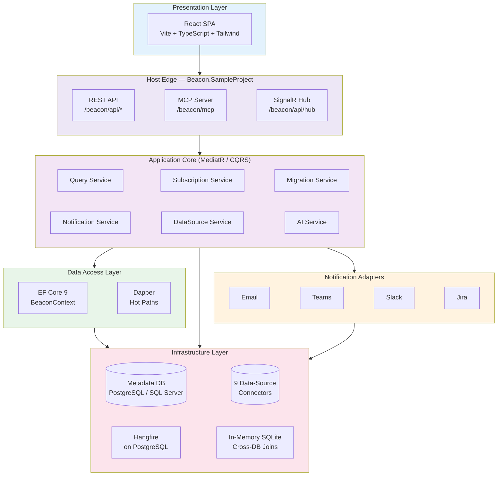
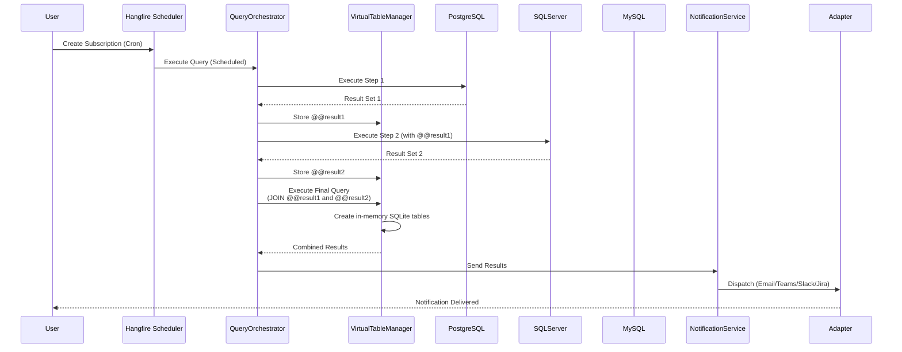
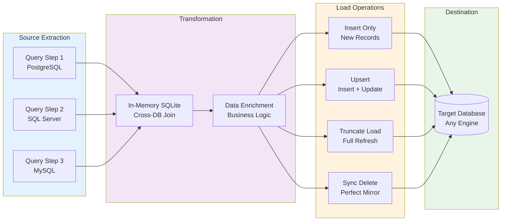

# Beacon

[](https://www.nuget.org/)
[](https://mibu.github.io/semantico)
[](LICENSE)
[](https://dotnet.microsoft.com/)
[](https://react.dev/)

## Semantic Database Monitoring & Orchestration

**Transform your database monitoring through intelligent queries, flexible alerting, and cross-database orchestration**

**Beacon** is a .NET 9 platform for semantic alerts, notifications, and data orchestration across your databases. Monitor data quality, enforce business rules, automate reporting, and orchestrate ETL workflows across PostgreSQL, SQL Server, MySQL, BigQuery, Snowflake, Databricks, Azure Synapse, AWS CloudWatch, and REST APIs — through a modern React UI, a REST API, and a built-in MCP server for AI assistants.

Beacon ships in two forms:

- **A self-hostable application** — clone this repo and run the `Beacon.SampleProject` host, which serves the React single-page app at the root URL `/`.
- **NuGet packages** — embed Beacon into your own ASP.NET Core application.

## 🎯 Core Capabilities

### 🔍 Query Monitoring
Create semantic SQL queries to monitor data quality, business rules, and database health with multi-step execution.

### 🔔 Smart Alerting
Deliver notifications via Email, Microsoft Teams, Slack, or Jira with rich formatting and complete result attachments.

### 🤖 AI-Powered Features
Automatic data-source documentation, natural-language alert creation, and intelligent anomaly detection — with a runtime-swappable LLM provider.

### 🔌 MCP Server
A built-in Model Context Protocol server gives AI assistants read-only, audited, PII-aware access to your data.

### 🔄 Data Migration
Orchestrate ETL workflows with Insert, Upsert, Truncate, and Sync modes across different database engines.

### 🔗 Cross-Database Joins
Query across multiple engines simultaneously via in-memory SQLite virtual tables.

### 📋 Task Management & Anomaly Detection
Automatic alerting tasks with lifecycle tracking, statistical anomaly detection, and intelligent auto-resolution.

### 🔐 Authorization & Access Control
Cookie sessions, pluggable authentication providers, OIDC/SSO, JWT for MCP clients, and scoped API keys.

## 🚀 Quick Start (run the app)

The fastest way to see Beacon is to run the host project and the React dev server.

**Prerequisites:** .NET 9 SDK, Node.js 18+, and a PostgreSQL database. Set a connection string and a 32-character encryption key in `Beacon.SampleProject/appsettings.json` (or user-secrets / environment variables):

```json
{
  "ConnectionStrings": {
    "BeaconContext": "Host=localhost;Database=beacon;Username=postgres;Password=yourpassword"
  },
  "Beacon": {
    "EncryptionKey": "your-secure-32-character-key-here"
  }
}
```

```bash
# 1. Start the API host (Kestrel) — http://localhost:5296 / https://localhost:7187
dotnet run --project Beacon.SampleProject --no-launch-profile

# 2. In another terminal, start the React dev server (Vite) — http://localhost:5173
npm run dev --prefix Beacon.UI/web
```

Open **http://localhost:5173** (Vite dev server, proxies `/beacon/api`, `/beacon/mcp`, and `/hangfire` to Kestrel). On first run, Beacon applies its EF Core migrations and walks you through **first-run admin setup** to create the initial user — there are no hardcoded credentials.

Useful endpoints:

| URL | What |
|---|---|
| `/` | React UI |
| `/beacon/api/health` | Health check |
| `/openapi/v1.json` | OpenAPI document (drives the typed TS client) |
| `/beacon/mcp` | MCP server (Streamable HTTP, auth required) |
| `/beacon/api/hub` | SignalR hub (real-time events) |
| `/hangfire` | Hangfire dashboard (admin only) |

📚 [View the detailed quick start guide →](https://mibu.github.io/semantico/getting-started/quick-start)

## 🏗️ System Architecture

Beacon follows a CQRS (MediatR) core where all project references converge on `Beacon.Core`:



### Query Execution Flow

Multi-step queries with cross-database capabilities:



### Data Migration Flow

ETL orchestration with multiple migration modes:



## ✨ Key Features

### 🔍 Semantic Query Monitoring
- Multi-step query execution with result chaining (`@@result1`, `@@result2`, …)
- Dynamic parameter substitution (`@@user_id`, `@@date`)
- Query preview and execution history with full audit trail

### ⏱️ Scheduling & Automation
- Cron expression support (every few minutes to monthly)
- Hangfire on PostgreSQL (1-second poll; automatic retry disabled by default)
- Pluggable scheduler via the `IBeaconScheduler` interface (`BeaconScheduler` is the Hangfire-backed implementation)

### 🔔 Multi-Channel Notifications
- **Email** with HTML table + CSV/Excel attachment
- **Microsoft Teams** with Adaptive Cards
- **Slack** with rich Table Blocks
- **Jira** issue creation and updates
- Full result attachments (unlimited rows)

### 🤖 AI-Powered Features (Experimental)
- **Automatic Documentation**: AI analyzes schemas and generates comprehensive documentation (export as Markdown, HTML with ERD diagrams, or PDF)
- **Natural Language Alerts**: Create complex queries from plain-English descriptions
- **Smart Insights**: AI-assisted data analysis and recommendations
- Runtime-swappable LLM provider (OpenAI, Anthropic Claude, Azure OpenAI, AWS Bedrock); all calls go through a concurrency-limited request queue

⚠️ **Note:** AI features are experimental and may produce incorrect or incomplete results. Always review AI-generated content before use.

### 🔌 MCP Server
- Streamable HTTP transport at `/beacon/mcp` (auth required)
- **Read-only enforced** at the connector level; PII detection and row limits on by default
- Every invocation recorded by an audit service and a usage-signal service that powers a self-improving "learning loop"

### 🔐 Authorization & Access Control
- Cookie sessions (`Beacon.Auth`: `HttpOnly`, `SameSite=Lax`)
- Pluggable authentication via `IBeaconAuthenticationProvider` (database, OIDC/SSO, custom)
- JWT bearer authentication for MCP clients
- Scoped API keys (`Read`, `Execute`, `Admin`) with optional project restrictions — SHA256-hashed at rest, shown once
- Role-based access control with first-run admin setup

### 🔍 Anomaly Detection
- Statistical methods (standard deviation, IQR, percentage change)
- Baseline learning from historical data, configurable thresholds, real-time alerting

### 💾 Multi-Database Support
- 9 connectors: PostgreSQL, SQL Server, MySQL, BigQuery, Snowflake, Databricks, Azure Synapse, AWS CloudWatch, REST API
- Cross-database joins via in-memory SQLite virtual tables
- Database metadata introspection with caching
- **Encrypted connection strings** (AES-256) with a mandatory encryption key

### 🔄 Data Migration (ETL)
- 4 migration modes: Insert, Upsert, Truncate, Sync
- Bulk operations (EFCore.BulkExtensions) with row-level error tracking
- Atomic transactions with rollback on failure, plus execution metrics

### 💻 Developer Experience
- React UI with a typed OpenAPI fetch client (NSwag, `npm run codegen`)
- SQL editor, database explorer, parameter validation, real-time updates via SignalR

### 📋 Task Management
- Automatic task creation from subscriptions with `CreateTasks` enabled
- Auto-resolution when a query returns 0 results
- Trend charts, comments, related-task discovery, manual resolution with notes

[Explore all features →](https://mibu.github.io/semantico/features/)

## 📦 Installation (embed via NuGet)

If you prefer to embed Beacon in your own ASP.NET Core host instead of running `Beacon.SampleProject`, install the packages you need.

### Packages

| Package | Purpose |
|---|---|
| `Beacon.Core` | Core domain, CQRS handlers, EF model (required) |
| `Beacon.Core.PostgreSql` / `Beacon.Core.SqlServer` | EF Core provider + migrations for Beacon's metadata DB |
| `Beacon.UI` | React SPA shipped as a Razor Class Library (served at `/`) |
| `Beacon.Api` | REST minimal-API endpoints + OpenAPI |
| `Beacon.MCP` | MCP server (tools + resources) |
| `Beacon.AI` | LLM integration, auto-documentation, anomaly detection (optional) |
| `Beacon.Connector.*` | One per engine: `PostgreSql`, `SqlServer`, `MySql`, `BigQuery`, `Snowflake`, `Databricks`, `AzureSynapse`, `CloudWatch`, `Api` |

**For PostgreSQL (recommended):**
```bash
dotnet add package Beacon.Core.PostgreSql
dotnet add package Beacon.UI
dotnet add package Beacon.Connector.PostgreSql
```

### Basic Setup

Add to your ASP.NET Core `Program.cs`:

```csharp
using Beacon.Core;
using Beacon.Core.PostgreSql;
using Beacon.Connector.PostgreSql;
using Beacon.UI;

var builder = WebApplication.CreateBuilder(args);

// 1. Core services + database provider + connectors
builder.Services.AddBeaconServices(builder.Configuration, options =>
    {
        options.AddBeaconScheduler<BeaconScheduler>();   // your IBeaconScheduler (Hangfire-backed)
        options.BaseUrl = "https://your-domain.com";     // for notification deep-links
        options.UseAI = true;                            // optional (experimental)
        options.Authorization.Enabled = true;
        options.Authentication.EnableLoginForm = true;
        options.AddAuthenticationProvider<DatabaseAuthenticationProvider>();
    })
    .AddPostgreSqlConnector()
    // .AddSqlServerConnector().AddMySqlConnector().AddBigQueryConnector() ... (add the engines you need)
    .UsePostgreSql(builder.Configuration.GetConnectionString("BeaconContext")!, "beacon");

// 2. Auth (cookie scheme for the React shell at root /)
builder.Services.AddBeaconCookieAuthentication("/");
// builder.Services.AddBeaconOidcAuthentication(builder.Configuration); // optional SSO

// 3. AI + MCP + OpenAPI (optional layers)
builder.Services.AddBeaconAI(builder.Configuration);
builder.Services.AddBeaconMcp();
builder.Services.AddOpenApi();

var app = builder.Build();

app.UseHttpsRedirection();
app.UseStaticFiles();

// Auth pipeline (order matters)
app.UseAuthentication();
app.UseAuthorization();

app.MapOpenApi();                       // /openapi/v1.json
app.MapBeaconApi();                     // /beacon/api/*
app.MapMcp("/beacon/mcp").RequireAuthorization();   // MCP server
app.MapBeaconUi();                      // React SPA at root /

app.Run();
```

> `Beacon.SampleProject/Program.cs` is the canonical, fully-wired reference (Hangfire, SignalR, OIDC, JWT-for-MCP, rate limiting, antiforgery, and the load-bearing middleware order). Start from it when embedding.

Add connection strings and the encryption key to `appsettings.json`:

```json
{
  "ConnectionStrings": {
    "BeaconContext": "Host=localhost;Database=beacon;Username=postgres;Password=yourpassword"
  },
  "Beacon": {
    "EncryptionKey": "your-secure-32-character-key-here",
    "LLM": {
      "Provider": "OpenAI",
      "ApiKey": "your-openai-api-key",
      "Model": "gpt-4o",
      "Limits": {
        "MaxConcurrentRequests": 5,
        "RequestsPerMinute": 60
      }
    }
  }
}
```

**Generate a secure encryption key:**
```bash
openssl rand -base64 32
```

⚠️ **Important:** The `EncryptionKey` is **required** — it encrypts connection strings and other sensitive data at rest. AI configuration is optional and experimental.

📚 [View the detailed installation guide →](https://mibu.github.io/semantico/getting-started/installation)

## 🧱 Project Layout

| Project | Role |
|---|---|
| `Beacon.Core` | Domain, CQRS handlers, services, EF model — everything points here |
| `Beacon.Core.PostgreSql` / `Beacon.Core.SqlServer` | Provider-specific `BeaconContext` + EF migrations |
| `Beacon.AI` | LLM integration, auto-documentation, anomaly detection, NL → query |
| `Beacon.MCP` | MCP server (tools + resources) for AI assistants |
| `Beacon.Api` | REST minimal-API endpoints + OpenAPI for the React shell |
| `Beacon.UI` | React SPA (`web/`) shipped as a Razor Class Library, served at `/` |
| `Beacon.SampleProject` | Host / composition root (Kestrel, DI wiring, Hangfire, middleware, auth) |
| `Beacon.Connector.*` | Data-source connectors for the 9 supported engines |
| `Beacon.Tests` | NUnit 4 + Moq + FluentAssertions; EF translation tests via `NpgsqlTestContext` |

## 🛠️ Technology Stack

### Framework & Runtime
- .NET 9.0 / C# 13 / ASP.NET Core 9.0 (Kestrel, self-hosted)

### User Interface
- React 18 + Vite 5 + TypeScript
- Tailwind CSS v3.4 + Beacon design-system primitives
- React Router; SignalR client for real-time updates; NSwag-generated typed API client

### Data Access
- Entity Framework Core 9 (PostgreSQL + SQL Server, dual migrations)
- Dapper (hot paths) + EFCore.BulkExtensions (bulk operations)

### Database Drivers / Connectors
- Npgsql, Microsoft.Data.SqlClient, MySqlConnector
- BigQuery, Snowflake, Databricks, Azure Synapse, AWS CloudWatch, generic REST API

### Background Jobs
- Hangfire on PostgreSQL (`IBeaconScheduler` abstraction); Cronos for cron parsing

### AI & Machine Learning
- OpenAI / Anthropic Claude / Azure OpenAI / AWS Bedrock (runtime-swappable)
- Concurrency-limited request queue with cost/usage tracking

### Document Generation
- QuestPDF (PDF), Markdig (Markdown), Mermaid (ERD diagrams)

### Integrations
- Atlassian.SDK (Jira), AdaptiveCards (Teams), ClosedXML (Excel), CsvHelper (CSV)

## 🔧 Requirements

- **.NET 9.0** SDK or later
- **Node.js 18+** (to build the React UI when developing or self-hosting)
- **PostgreSQL 12+** or **SQL Server 2019+** for Beacon's metadata database
- **Encryption key** (32-character key for AES-256) — **required**
- **(Optional)** LLM API key (OpenAI, Anthropic, Azure OpenAI, or AWS Bedrock) for AI features
- **(Optional)** SMTP/email provider for email notifications

## 🚦 Getting Started

### Step 1: Connect Data Sources
Add your databases or APIs with encrypted connection strings.

### Step 2: Create Semantic Queries
Write SQL to monitor data quality, enforce business rules, or extract data for migration.

### Step 3: Schedule & Automate
Create subscriptions with cron schedules and configure notification recipients.

### Step 4: Track & Resolve
Enable task creation to track issues, add comments, and manage the resolution lifecycle.

## 🤝 Support and Contributing

- **Issues** — [Report bugs or request features](https://github.com/MiBu/semantico/issues)
- **Discussions** — [Ask questions and share ideas](https://github.com/MiBu/semantico/discussions)

---

## 📚 Resources

**Documentation**: [https://mibu.github.io/semantico](https://mibu.github.io/semantico)
**Repository**: [https://github.com/MiBu/semantico](https://github.com/MiBu/semantico)
**Version**: 1.0
**Copyright**: © 2026

Thank you for choosing Beacon! We hope you find it invaluable for managing your database monitoring, alerting, and orchestration needs.
</content>
