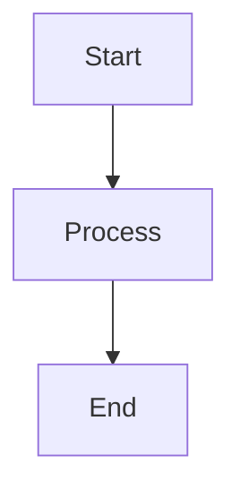

# GitHub Pages Enhancement Changelog

## Summary

Enhanced the Beacon GitHub Pages documentation with two major features:
1. **Centralized URL Configuration** - Define URLs once, use throughout documentation
2. **Mermaid Diagram Support** - Display system architecture and flow diagrams

## Changes Made

### 1. Centralized URL Configuration

**File**: `docs/_config.yml`

Added a `urls` section for centralized URL management:

```yaml
urls:
  # Repository
  github_repo: "https://github.com/moberghr/beacon"
  github_issues: "https://github.com/moberghr/beacon/issues"
  github_discussions: "https://github.com/moberghr/beacon/discussions"

  # Documentation
  docs_base: "https://moberghr.github.io/beacon"
  docs_installation: "https://moberghr.github.io/beacon/getting-started/installation"
  docs_quick_start: "https://moberghr.github.io/beacon/getting-started/quick-start"
  # ... and more
```

**Benefits**:
- Single source of truth for all URLs
- Easy to update URLs across the entire documentation
- Prevents broken links from typos
- Better maintainability

**Usage**:
```markdown
[View on GitHub]({{ site.urls.github_repo }})
[Report Issues]({{ site.urls.github_issues }})
```

### 2. Mermaid Diagram Support

**File**: `docs/_includes/head_custom.html`

Added Mermaid.js library integration for rendering diagrams:

```html
<script type="module">
  import mermaid from 'https://cdn.jsdelivr.net/npm/mermaid@10.6.1/dist/mermaid.esm.min.mjs';
  mermaid.initialize({
    startOnLoad: true,
    theme: 'default',
    themeVariables: {
      primaryColor: '#1976d2',
      // ... custom theme
    }
  });
</script>
```

**Configuration**: `docs/_config.yml`
```yaml
mermaid:
  version: "10.6.1"
```

### 3. Enhanced Homepage Content

**File**: `docs/index.md`

Added three comprehensive architecture diagrams from README:

1. **System Architecture** - Clean Architecture layers and components
2. **Query Execution Flow** - Multi-step query orchestration sequence
3. **Data Migration Flow** - ETL pipeline with migration modes

These diagrams provide visual understanding of:
- Component relationships and data flow
- Multi-database query execution process
- ETL orchestration capabilities

### 4. Documentation Guide

**File**: `docs/URL_CONFIGURATION.md`

Created comprehensive guide explaining:
- How to use centralized URL configuration
- Examples and best practices
- Adding new URLs to the configuration
- Testing and troubleshooting

## Files Modified

- `docs/_config.yml` - Added URLs section and Mermaid configuration
- `docs/index.md` - Added 3 Mermaid diagrams and updated links to use centralized URLs
- `docs/_includes/head_custom.html` - Created for Mermaid support (new file)
- `docs/URL_CONFIGURATION.md` - Created usage guide (new file)
- `docs/CHANGELOG_GITHUB_PAGES.md` - This file (new)

## Testing Results

Build Status: ✅ **Success**

```
Configuration file: /Users/mirkobudimir/Dev/moberghr/beacon/docs/_config.yml
      Remote Theme: Using theme just-the-docs/just-the-docs
            Source: /Users/mirkobudimir/Dev/moberghr/beacon/docs
       Destination: /Users/mirkobudimir/Dev/moberghr/beacon/docs/_site
      Generating...
                    done in 2.094 seconds.
```

Verification:
- ✅ Mermaid script loaded correctly (9 references found)
- ✅ CDN link present in generated HTML
- ✅ System Architecture section rendered
- ✅ Centralized URLs resolved correctly

## How to Use

### Using Centralized URLs

In any markdown file:

```markdown
Visit our [documentation]({{ site.urls.docs_base }}) for more information.
Report bugs on [GitHub Issues]({{ site.urls.github_issues }}).
```

### Creating Mermaid Diagrams

In any markdown file, use fenced code blocks:

````markdown

````

The diagrams will be automatically rendered when the page loads.

## Next Steps

1. **Deploy to GitHub Pages**:
   - Push changes to main branch
   - GitHub Actions will automatically build and deploy
   - Site available at: https://moberghr.github.io/beacon

2. **Extend URL Configuration**:
   - Add more URLs as needed to `_config.yml`
   - Update existing documentation to use centralized URLs

3. **Add More Diagrams**:
   - Add Mermaid diagrams to other documentation pages
   - Use consistent color schemes (already configured)

## Compatibility

- **Jekyll**: 3.10.0+
- **Theme**: just-the-docs (remote theme)
- **Mermaid**: 10.6.1
- **Browser Support**: All modern browsers with ES6 module support

## Migration Notes

If you need to update any URLs in the future:

1. Edit `docs/_config.yml` under the `urls` section
2. No need to search through individual markdown files
3. Rebuild the site: `bundle exec jekyll build`
4. All pages will automatically use the updated URLs

## Support

For questions about these enhancements:
- See `docs/URL_CONFIGURATION.md` for URL configuration guide
- Mermaid documentation: https://mermaid.js.org/
- just-the-docs theme: https://just-the-docs.github.io/just-the-docs/

---

**Date**: 2025-11-12
**Version**: 1.0.0
**Author**: Beacon Team
