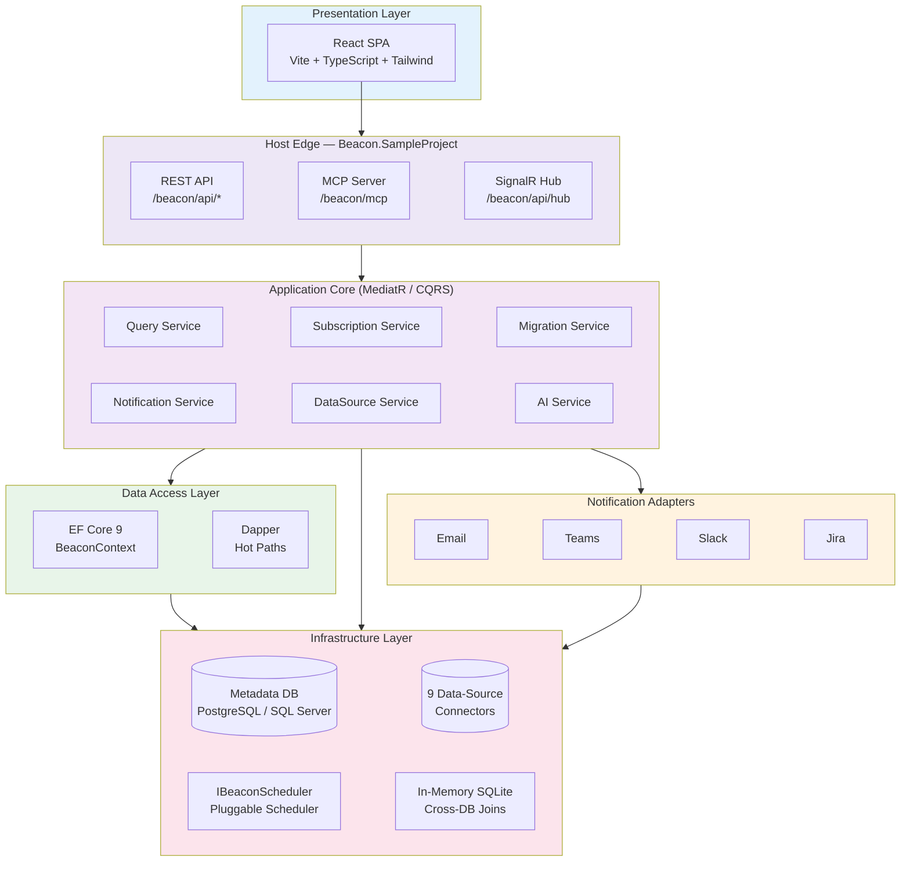
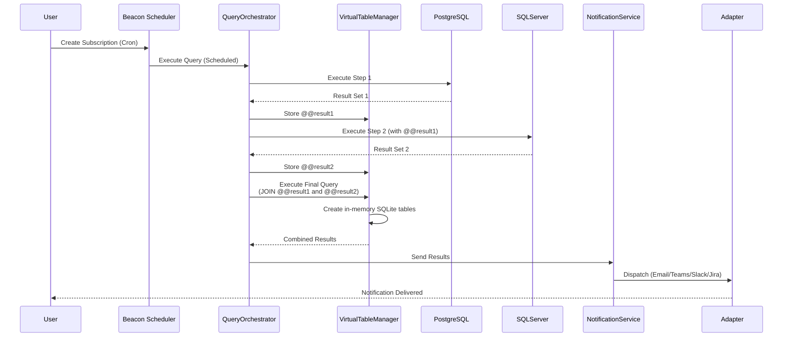
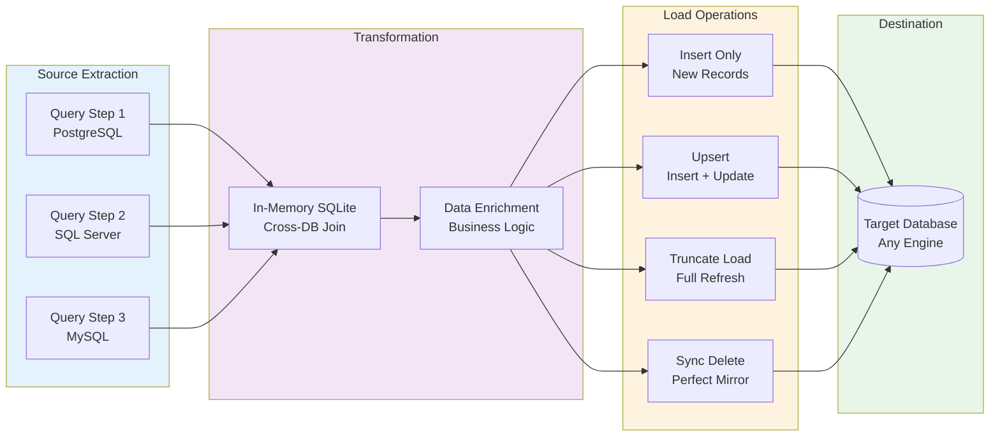

# The database monitoring platform built for the AI era
{: .fs-9 }

Semantic alerts, cross-database orchestration, and a governed MCP server — so your team *and* your AI assistants can watch, query, and move data safely.
{: .fs-6 .fw-300 }

[Get Started](getting-started/quick-start){: .btn .btn-primary .fs-5 .mb-4 .mb-md-0 .mr-2 }
[View on GitHub]({{ site.urls.github_repo }}){: .btn .fs-5 .mb-4 .mb-md-0 }


*Shown with sample data from Beacon's built-in mock mode (`npm run dev:mock`).*

---

## Why Beacon?

Beacon is a .NET 9 platform that turns database monitoring into semantic queries, flexible alerting, and cross-database orchestration. You can run it **two ways**:

- **As a self-hostable app** — clone the repo and run the `Beacon.SampleProject` host, which serves the React UI at the root URL `/`.
- **As NuGet packages** — embed Beacon into your own ASP.NET Core application.

Highlights:

- **9 data sources**: PostgreSQL, SQL Server, MySQL, BigQuery, Snowflake, Databricks, Azure Synapse, AWS CloudWatch, and a generic REST API connector
- **Flexible alerting**: Email, Microsoft Teams, Slack, and Jira notifications with cron scheduling, plus automatic [alerting tasks](features/tasks) with lifecycle tracking
- **Control Tower**: [real-time health](features/control-tower) across every scheduled check — success rates, anomalies, open tasks — in one auto-refreshing view
- **Query chaining**: multi-step queries with cross-database joins via in-memory SQLite (`@@result1`, `@@result2`)
- **Full results as attachments**: email notifications include complete datasets as CSV for Excel analysis
- **Governed MCP server**: read-only enforced, PII-aware, fully audited access for AI assistants at `/beacon/mcp` — with **M-Schema-grounded SQL generation, AST validation, and a dry-run repair loop**
- **A learning loop**: the MCP server records usage signals and turns them into approved schema clarifications and documentation patches — answers improve with use
- **Modern React UI**: React 18 + Vite + TypeScript + Tailwind CSS with light & dark themes, served at `/`
- **AI-powered (experimental)**: auto-documentation, natural-language → SQL alerts, statistical [anomaly detection](features/anomaly-detection), and [AI actors](features/ai-actors) gated by a human approval workflow
- **Schema-agnostic**: multi-tenant support with runtime schema configuration

---

## 🏗️ System Architecture

Beacon follows a CQRS (MediatR) core with all references converging on `Beacon.Core`:



### Query Execution Flow

Multi-step queries with cross-database capabilities:



### Data Migration Flow

ETL orchestration with multiple migration modes:



---

## Use Cases

### 🚨 Data Validation Alerts

**Problem**: Teams need to ensure data meets business rules and catch data quality issues early.

**Solution**: Create queries that trigger alerts when data is invalid, missing, or violates constraints — orphaned records, null required fields, invalid state combinations. Also used by DBAs for database-health metrics (table size, connection count, replication lag). Enable task creation to track every incident through to resolution.

**Benefits**: Early detection, automated data-quality checks, a [Control Tower](features/control-tower) view of overall health.

[Learn more about alerting →](features/subscriptions)

---

### 📊 Scheduled Reports with Attachments

**Problem**: Teams need automated reports delivered regularly without manual SQL execution.

**Solution**: Schedule queries with cron expressions and receive full results as Excel/CSV attachments via email. Perfect for daily sales reports, weekly analytics, or monthly summaries.

**Benefits**: Zero-touch reporting, full-dataset delivery, Excel-ready format, automated scheduling.

[Learn more about notifications →](features/notifications)

---

### 🔄 Data Migration Orchestration

**Problem**: Teams need auditable data migration across environments and engines.

**Solution**: Data migration jobs with Insert/Upsert/Truncate/Sync modes, execution history, validation checks, and error tracking.

**Benefits**: Compliance audit trail, repeatable workflows, error visibility.

[Learn more about data migrations →](features/data-migration)

---

### 🤖 AI Assistants via MCP

**Problem**: AI assistants need safe, governed access to query your databases — and naive prompt-to-SQL pipes produce wrong answers.

**Solution**: Beacon's built-in MCP server exposes read-only, PII-aware tools over Streamable HTTP at `/beacon/mcp`. SQL generation is grounded in an **M-Schema context with real sample values**, validated by a **multi-dialect AST parser**, and self-corrected through a **dry-run repair loop**. Every call is audited, and a **learning loop** turns usage signals into approved documentation improvements.

**Benefits**: Read-only enforcement, row limits, PII masking, audit trail, and accuracy that improves with use.

[Learn more about the MCP server →](features/mcp-server)

---

## Quick Start

### Option A — Run the app

```bash
# 1. Start the API host (Kestrel) — http://localhost:5296 / https://localhost:7187
dotnet run --project Beacon.SampleProject --no-launch-profile

# 2. Start the React dev server (Vite) — http://localhost:5173, proxies /beacon/api
npm run dev --prefix src/Beacon.UI/web
```

Open `http://localhost:5173` (dev) or `http://localhost:5296` (served build). On first run, Beacon applies its EF Core migrations and walks you through first-run admin setup. Health check: `http://localhost:5296/beacon/api/health`.

Want to explore the UI without any backend? `npm run dev:mock --prefix src/Beacon.UI/web` runs the full SPA against realistic in-browser mock data (MSW).

### Option B — Embed via NuGet

```bash
dotnet add package Beacon.Core.PostgreSql
dotnet add package Beacon.UI
```

```csharp
using Beacon.Core;
using Beacon.Core.PostgreSql;
using Beacon.UI;

builder.Services.AddBeaconServices(builder.Configuration, options =>
    {
        options.AddBeaconScheduler<YourScheduler>();   // your IBeaconScheduler implementation
        options.UseAI = true;                          // optional, experimental
    })
    .AddPostgreSqlConnector()
    .UsePostgreSql(builder.Configuration.GetConnectionString("BeaconContext")!, "beacon");

builder.Services.AddBeaconCookieAuthentication("/");

var app = builder.Build();
app.UseStaticFiles();
app.UseAuthentication();
app.UseAuthorization();
app.MapBeaconApi();   // /beacon/api/*
app.MapBeaconUi();    // React SPA at root /
app.Run();
```

**appsettings.json:**
```json
{
  "ConnectionStrings": {
    "BeaconContext": "Host=localhost;Database=beacon;Username=postgres;Password=yourpassword"
  },
  "Beacon": {
    "EncryptionKey": "your-secure-32-character-key-here"
  }
}
```

[View the detailed installation guide →](getting-started/installation)

---

## Features

### Core Capabilities

- **[Data Sources](features/data-sources)**: Manage encrypted connections across 9 engines
- **[Queries](features/queries)**: Define SQL queries with parameters and multi-step chaining
- **[Subscriptions](features/subscriptions)**: Schedule execution with cron expressions
- **[Notifications](features/notifications)**: Deliver results via Email, Teams, Slack, or Jira
- **[Data Migrations](features/data-migration)**: Orchestrate ETL with Insert/Upsert/Truncate/Sync
- **[Anomaly Detection](features/anomaly-detection)**: Statistical baselines and deviation alerts

### Operations & Quality

- **[Control Tower](features/control-tower)**: Real-time health across all subscriptions
- **[Tasks](features/tasks)**: Automatic alerting tasks with lifecycle tracking and auto-resolution
- **[Data Quality](features/data-quality)**: Data contracts with scheduled evaluations and scoring

### Platform & Admin

- **[User Management](features/user-management)**: Internal/external users, role-based access, first-run setup
- **[Authorization](features/authorization)**: Pluggable auth providers, cookie sessions, OIDC/SSO
- **[API Keys](features/api-keys)**: Scoped, SHA256-hashed keys with per-project restrictions
- **[Admin Settings](features/admin-settings)**: Runtime configuration, hot-swap LLM providers, audit trail
- **[MCP Server](features/mcp-server)**: Read-only, audited database access for AI assistants — with playground and learning loop
- **[AI Integration](features/ai-integration)** (experimental): Auto-documentation and NL → SQL alerts
- **[AI Actors](features/ai-actors)** (experimental): LLM-driven monitoring agents with human approval gates

---

## Documentation

<div class="code-example" markdown="1">
### 🚀 Getting Started

New to Beacon? Start here.

- [Installation Guide](getting-started/installation)
- [Quick Start](getting-started/quick-start)
- [Configuration Reference](getting-started/configuration)
</div>

<div class="code-example" markdown="1">
### 📖 Features

Explore all capabilities with detailed guides and examples.

- [Data Sources](features/data-sources)
- [Queries](features/queries)
- [Subscriptions](features/subscriptions)
- [MCP Server](features/mcp-server)
- [See all features →](features/)
</div>

<div class="code-example" markdown="1">
### 💬 Support

Get help and contribute to the project.

- [GitHub Issues]({{ site.urls.github_issues }})
- [GitHub Discussions]({{ site.urls.github_discussions }})
</div>

---

## Key Features at a Glance

| Feature | Description |
|---------|-------------|
| **9 Data Sources** | PostgreSQL, SQL Server, MySQL, BigQuery, Snowflake, Databricks, Azure Synapse, CloudWatch, REST API |
| **React UI** | React 18 + Vite + TypeScript + Tailwind, light & dark themes, served at `/` |
| **REST API** | `/beacon/api/*` minimal APIs (one endpoint per MediatR handler), OpenAPI at `/openapi/v1.json` |
| **MCP Server** | Read-only, audited database access for AI assistants at `/beacon/mcp` |
| **SQL Accuracy Stack** | M-Schema grounding with sample values, AST read-only validation, dry-run repair loop |
| **MCP Learning Loop** | Usage signals become approved schema patterns and documentation patches |
| **Control Tower** | Real-time subscription health with anomaly sparklines and open-task counts |
| **Cron Scheduling** | Pluggable `IBeaconScheduler` with flexible cron expressions — pair it with [Moberg Warp](https://moberghr.github.io/warp/) |
| **Multi-Step Queries** | Chain queries with result aggregation and cross-DB joins |
| **Notifications** | Email (with CSV attachments), Teams, Slack, Jira delivery |
| **Alerting Tasks** | Auto-created from failed checks, auto-resolved when data recovers |
| **Encrypted Secrets** | Connection strings encrypted at rest (AES-256-GCM); API keys SHA256-hashed |
| **User Management** | Built-in users, roles, OIDC/SSO, API keys, first-run setup |
| **Schema-Agnostic** | Multi-tenant deployments with runtime schema selection |
| **Execution History** | Complete audit trail of all executions |

---

## Requirements

- **.NET 9.0** SDK or later
- **Node.js 18+** (for building the React UI when developing or self-hosting)
- **PostgreSQL 12+** or **SQL Server 2019+** for Beacon's metadata database
- **Encryption key** (32-character key for AES-256) — **required** (`Beacon:EncryptionKey`)
- **(Optional)** LLM API key (OpenAI, Anthropic, Azure OpenAI, or AWS Bedrock) for AI features
- **(Optional)** SMTP/email provider for email notifications

---

## Community and Support

- **GitHub Repository**: [moberghr/beacon]({{ site.urls.github_repo }})
- **Report Issues**: [GitHub Issues]({{ site.urls.github_issues }})
- **Discussions**: [GitHub Discussions]({{ site.urls.github_discussions }})

---

**Built for .NET developers who need powerful database monitoring and alerting — and safe AI access to their data**
