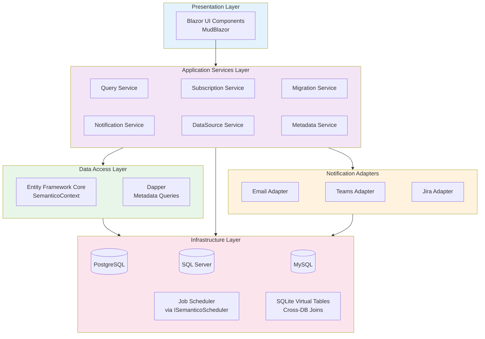
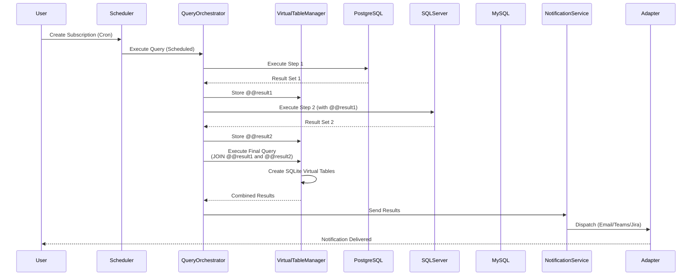
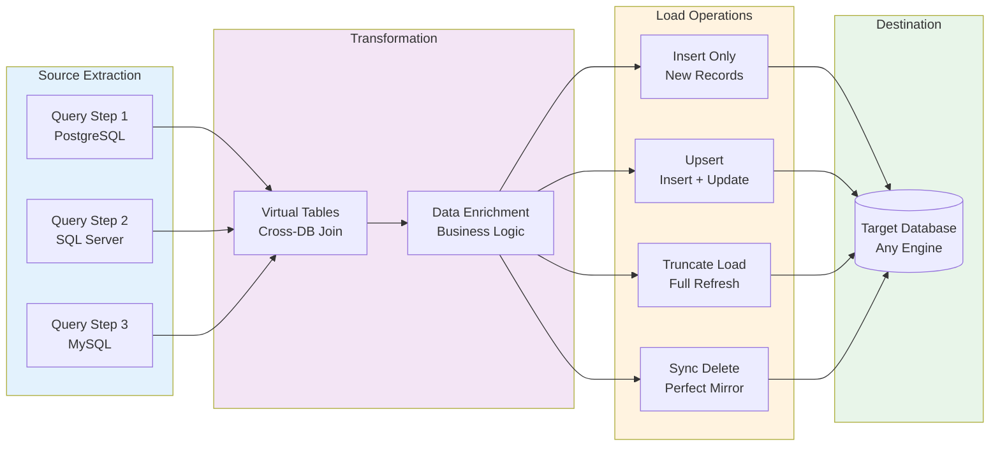

# Semantico
{: .fs-9 }

Powerful semantic alerts and notifications for your databases
{: .fs-6 .fw-300 }

[Get Started](getting-started/quick-start){: .btn .btn-primary .fs-5 .mb-4 .mb-md-0 .mr-2 }
[View on GitHub]({{ site.urls.github_repo }}){: .btn .fs-5 .mb-4 .mb-md-0 }

---

## Why Semantico?

Semantico is a .NET library that transforms database monitoring with semantic queries, flexible alerting, and cross-database orchestration.

- **Multi-Database Support**: PostgreSQL, SQL Server, and MySQL in one unified platform
- **Flexible Alerting**: Email, Microsoft Teams, and Jira notifications with cron scheduling
- **Query Chaining**: Multi-step queries with cross-project and cross-database capabilities
- **Full Results as Attachments**: Email notifications include complete datasets as CSV for Excel analysis
- **NuGet Integration**: Add to your ASP.NET Core application in minutes
- **Blazor Admin UI**: Modern, responsive UI for managing queries and subscriptions
- **Schema-Agnostic**: Multi-tenant support with runtime schema configuration

---

## 🏗️ System Architecture

Semantico follows Clean Architecture principles with clear separation of concerns:



### Query Execution Flow

Multi-step queries with cross-database capabilities:



### Data Migration Flow

ETL orchestration with multiple migration modes:



---

## Use Cases

### 🚨 Data Validation Alerts

**Problem**: Developers need to ensure data meets business rules and catch data quality issues early

**Solution**: Create queries that trigger alerts when data is invalid, missing, or violates constraints - such as orphaned records, null required fields, or invalid state combinations. Also used by DBAs for database health metrics (table size, connection count, replication lag).

**Benefits**: Early detection of data issues, automated data quality checks, prevent invalid states from reaching production

[Learn more about alerting →](features/subscriptions)

---

### 📊 Scheduled Reports with Attachments

**Problem**: Teams need automated reports delivered regularly without manual SQL execution

**Solution**: Schedule queries with cron expressions and receive full results as Excel/CSV attachments via email. Perfect for daily sales reports, weekly analytics, or monthly summaries delivered directly to stakeholders.

**Benefits**: Zero-touch reporting, full dataset delivery, Excel-ready format, automated scheduling

[Learn more about notifications and attachments →](features/notifications)

---

### 🔄 Data Migration Orchestration

**Problem**: Development teams need auditable data migration tracking across environments

**Solution**: Data migration jobs with execution history, validation checks, and error tracking

**Benefits**: Compliance audit trail, repeatable workflows, error visibility

[Learn more about data migrations →](features/data-migration)

---

## Quick Start

Add Semantico to your ASP.NET Core application in under 30 minutes:

### 1. Install NuGet Packages

```bash
dotnet add package Semantico.Core.PostgreSql
dotnet add package Semantico.UI.AspNet
```

### 2. Configure in Program.cs

```csharp
using Semantico.Core;
using Semantico.UI.AspNet;

// Add Semantico with PostgreSQL (single method call)
builder.Services.AddSemantico(builder.Configuration, options =>
{
    options.UsePostgreSql(builder.Configuration.GetConnectionString("SemanticoContext")!, "semantico");
    options.AddSemanticoScheduler<YourHangfireScheduler>();
});

var app = builder.Build();

app.UseStaticFiles(); // Required for Semantico UI assets

// Configure UI
app.UseSemanticoUI()
    .UseBasicAuthentication("admin", "admin")
    .AddBlazorUI("/semantico");
```

### 3. Add Connection String

**appsettings.json:**
```json
{
  "ConnectionStrings": {
    "SemanticoContext": "Host=localhost;Database=semantico;Username=postgres;Password=yourpassword"
  }
}
```

### 4. Run Application

```bash
dotnet run
```

Access Semantico UI at `http://localhost:5000/semantico`

[View detailed quick start guide →](getting-started/quick-start)

---

## Features

### Core Capabilities

- **[Projects](features/projects)**: Manage database connections across providers
- **[Queries](features/queries)**: Define SQL queries with parameter support
- **[Multi-Step Queries](features/multi-step-queries)**: Chain queries with result aggregation
- **[Subscriptions](features/subscriptions)**: Schedule execution with cron expressions
- **[Notifications](features/notifications)**: Deliver results via email, Teams, or Jira
- **[Data Migrations](features/data-migration)**: Orchestrate and track schema migrations

### Advanced Features

- **[Query Chaining](advanced/query-chaining)**: Execute queries across multiple projects
- **[Cross-Database Queries](advanced/cross-database)**: Combine data from different database types
- **[Multi-Tenant Deployments](advanced/multi-tenant)**: Schema-agnostic configuration
- **[Architecture](advanced/architecture)**: Clean Architecture deep-dive

---

## Documentation

<div class="code-example" markdown="1">
### 🚀 Getting Started

New to Semantico? Start here to add Semantico to your application.

- [Installation Guide](getting-started/installation)
- [Quick Start (30 minutes)](getting-started/quick-start)
- [Configuration Reference](getting-started/configuration)
</div>

<div class="code-example" markdown="1">
### 📖 Features

Explore all capabilities with detailed guides and examples.

- [Projects](features/projects)
- [Queries](features/queries)
- [Subscriptions](features/subscriptions)
- [Notifications](features/notifications)
- [See all features →](features/)
</div>

<div class="code-example" markdown="1">
### 🔧 Advanced Topics

Power user scenarios and extensibility patterns.

- [Query Chaining](advanced/query-chaining)
- [Multi-Tenant Deployments](advanced/multi-tenant)
- [Architecture Overview](advanced/architecture)
- [See all advanced topics →](advanced/)
</div>

<div class="code-example" markdown="1">
### 💬 Support

Get help and contribute to the project.

- [Troubleshooting](troubleshooting/common-issues)
- [GitHub Issues](https://github.com/MiBu/semantico/issues)
- [Contributing Guidelines](contributing/guidelines)
</div>

---

## Key Features at a Glance

| Feature | Description |
|---------|-------------|
| **Multi-Database** | Connect to PostgreSQL, SQL Server, MySQL |
| **NuGet Package** | Easy integration into ASP.NET Core applications |
| **Cron Scheduling** | Flexible execution timing with cron expressions |
| **Multi-Step Queries** | Chain queries with result aggregation |
| **Cross-Database** | Query multiple databases in single workflow |
| **Notifications** | Email (with CSV attachments), Teams, Jira delivery |
| **Full Dataset Attachments** | Email includes complete query results as CSV (unlimited rows) |
| **Parameters** | Dynamic query values with placeholders |
| **Schema-Agnostic** | Multi-tenant deployments with runtime schema selection |
| **Execution History** | Complete audit trail of all executions |
| **Blazor UI** | Modern admin interface with MudBlazor |

---

## Requirements

- **.NET 9.0** or later
- **ASP.NET Core** web application
- **PostgreSQL 12+** or **SQL Server 2019+** for Semantico metadata
- **Job scheduler** implementing `ISemanticoScheduler` (e.g., Hangfire, Quartz.NET, or custom)
- **(Optional)** Email provider for email notifications (SMTP, etc.)

---

## Community and Support

- **GitHub Repository**: [MiBu/semantico]({{ site.urls.github_repo }})
- **Report Issues**: [GitHub Issues]({{ site.urls.github_issues }})
- **Discussions**: [GitHub Discussions]({{ site.urls.github_discussions }})
- **Contribute**: [Contribution Guidelines]({{ site.urls.docs_contributing }})

---

**Built for .NET developers who need powerful database monitoring and alerting**
