# Multi-Agent Documentation Workflow - Visual Diagram

## High-Level Flow

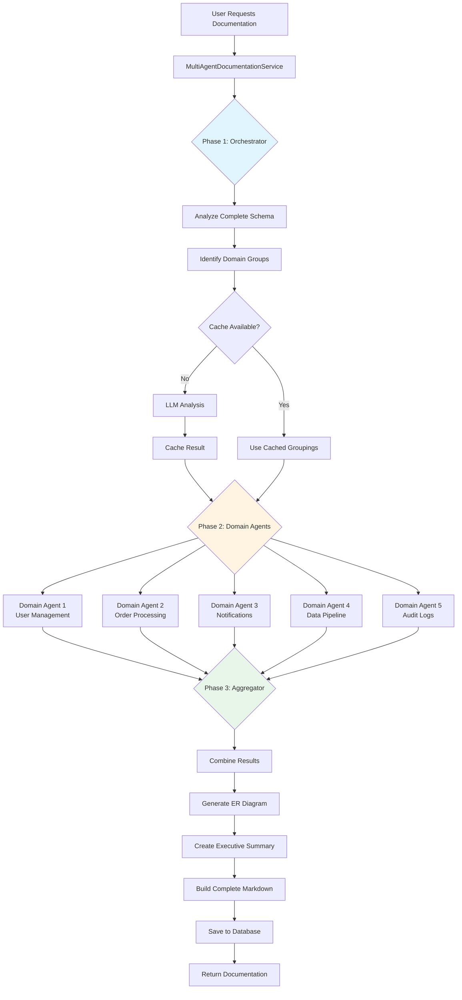

## Detailed Phase Breakdown

### Phase 1: Orchestrator Agent

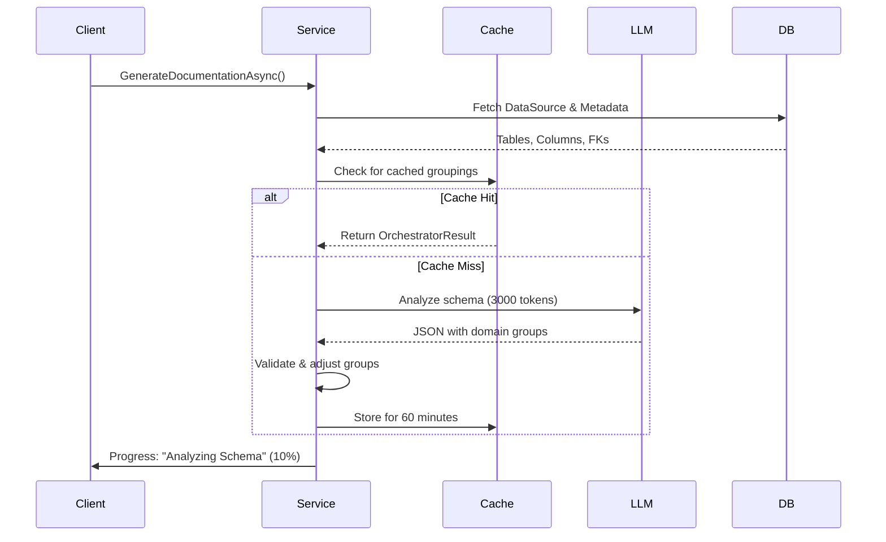

### Phase 2: Parallel Domain Agents

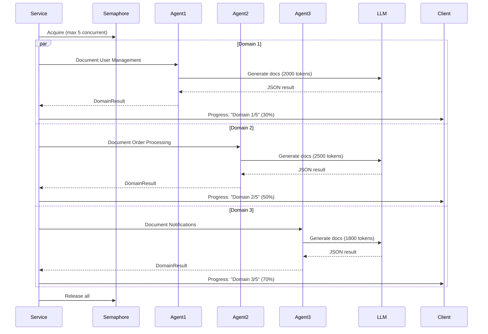

### Phase 3: Aggregator Agent

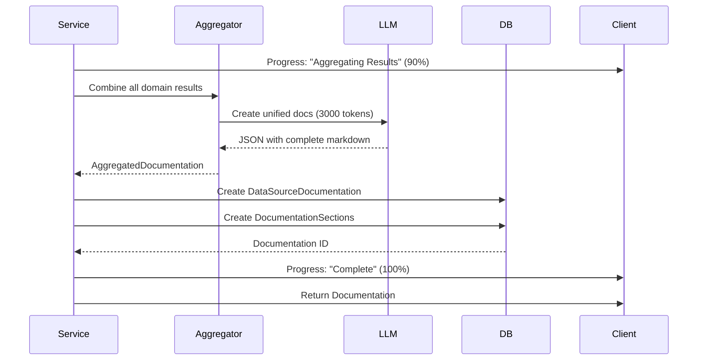

## Data Flow

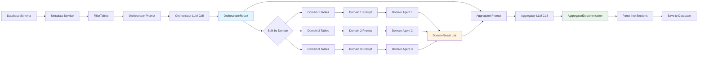

## Component Architecture

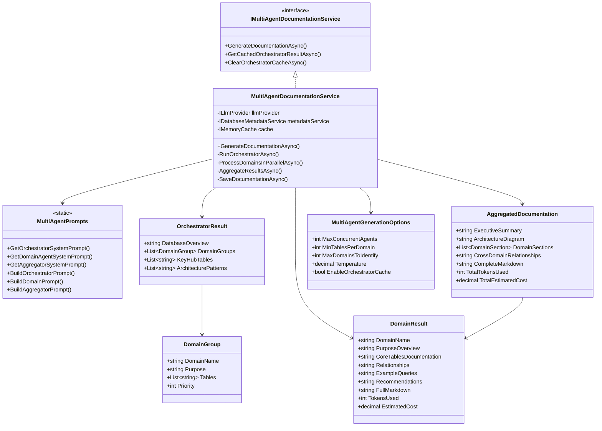

## Token Usage Breakdown

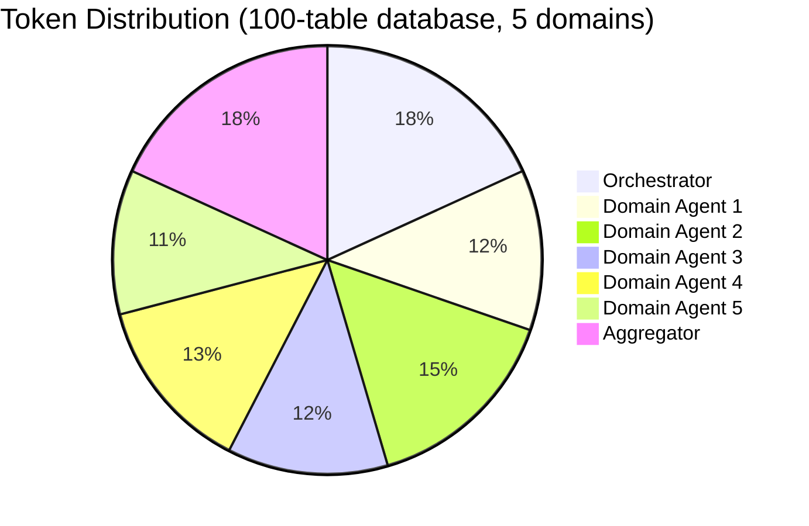

## Performance Comparison

```mermaid
gantt
    title Documentation Generation Time Comparison
    dateFormat  s
    axisFormat %S

    section Single-Agent
    Schema Analysis + Documentation :a1, 0, 60s

    section Multi-Agent
    Orchestrator :b1, 0, 8s
    Domain 1 :b2, 8, 12s
    Domain 2 :b3, 8, 12s
    Domain 3 :b4, 8, 12s
    Domain 4 :b5, 8, 12s
    Domain 5 :b6, 8, 12s
    Aggregator :b7, 20, 6s
```

## Error Handling Flow

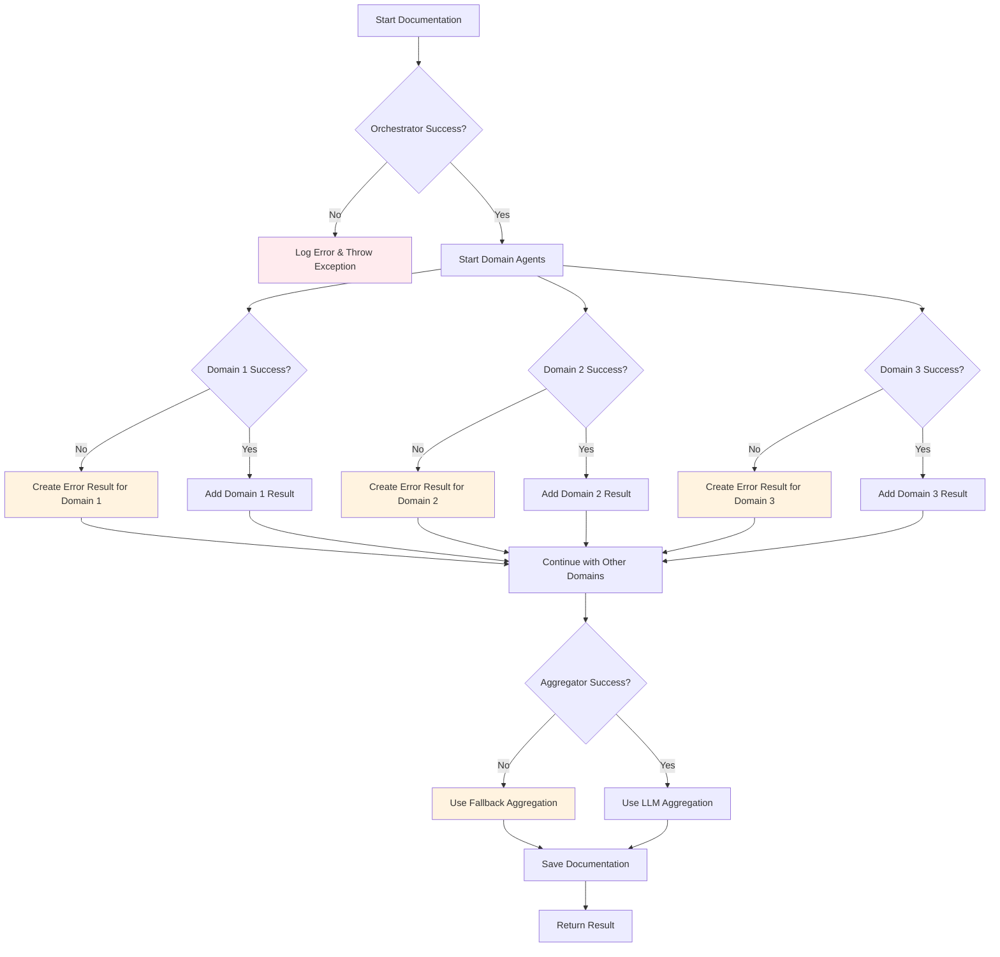

## Cache Strategy

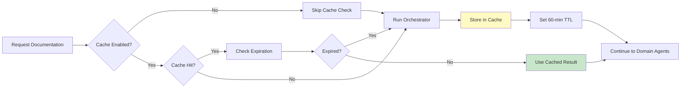

## Progress Updates Timeline

```mermaid
gantt
    title Progress Updates During Generation
    dateFormat  s
    axisFormat %S

    section Progress Events
    Analyzing Schema (10%) :milestone, m1, 0, 0s
    Identified 5 Domains :milestone, m2, 8, 0s
    Domain 1 Complete (26%) :milestone, m3, 12, 0s
    Domain 2 Complete (42%) :milestone, m4, 14, 0s
    Domain 3 Complete (58%) :milestone, m5, 16, 0s
    Domain 4 Complete (74%) :milestone, m6, 18, 0s
    Domain 5 Complete (90%) :milestone, m7, 20, 0s
    Aggregating Results (95%) :milestone, m8, 22, 0s
    Complete (100%) :milestone, m9, 26, 0s
```
