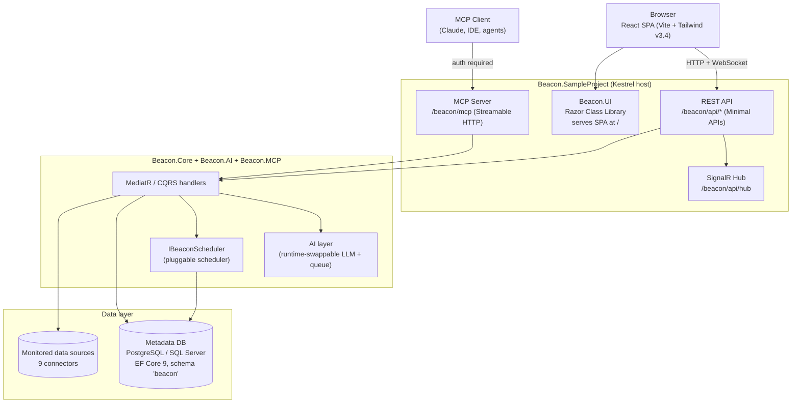

Beacon is a .NET 9 platform for semantic database monitoring, alerting, ETL / data migration, and cross-database queries, with an AI layer and a built-in MCP server. This section takes you from zero to your first scheduled database alert.

## How Beacon Is Delivered

Beacon ships two ways, and you can use either:

1. **As a self-hostable application** — clone the repository and run the `Beacon.SampleProject` host (the composition root). It boots Kestrel, serves the React single-page app at the root URL, exposes the REST API, MCP server, and SignalR hub, and applies database migrations on first run.
2. **As NuGet packages** — embed Beacon into your own ASP.NET Core application by referencing the `Beacon.*` packages and wiring them in `Program.cs`.

The [Installation](/getting-started/installation/) guide covers both paths in detail.

## What You'll Learn

- **Installation** — run the host or embed Beacon into your own ASP.NET Core app
- **Quick Start** — create your first data source, query, subscription, and notification
- **Configuration** — connection strings, encryption key, auth, AI/LLM, and scheduling

## Prerequisites

Before you begin, ensure you have:

- **.NET 9.0 SDK** or later
- **PostgreSQL 12+** or **SQL Server 2019+** for Beacon's metadata database
- **Node.js 18+** and npm (only if you build or run the React frontend from source)
- An **encryption key** (`Beacon:EncryptionKey`) — required; generate with `openssl rand -base64 32`
- Basic SQL knowledge

## Architecture at a Glance

## Quick Overview

Beacon enables you to:

1. **Connect** to your data sources — PostgreSQL, SQL Server, MySQL, Google BigQuery, Snowflake, Databricks, Azure Synapse, AWS CloudWatch, and generic REST APIs (9 connectors)
2. **Define** SQL queries (including cross-database queries) to monitor your data
3. **Schedule** execution with cron expressions via the pluggable scheduler
4. **Deliver** results via Email, Microsoft Teams, or Jira
5. **Migrate** data between databases with ETL pipelines
6. **Integrate** with AI agents through the built-in MCP server

## Next Steps

- [Installation](/getting-started/installation/) — run the host or embed Beacon into your ASP.NET Core app
- [Quick Start](/getting-started/quick-start/) — create your first data source, query, and notification
- [Configuration](/getting-started/configuration/) — connection strings, encryption, auth, AI/LLM, and scheduling
